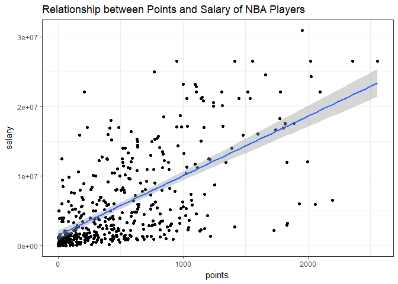
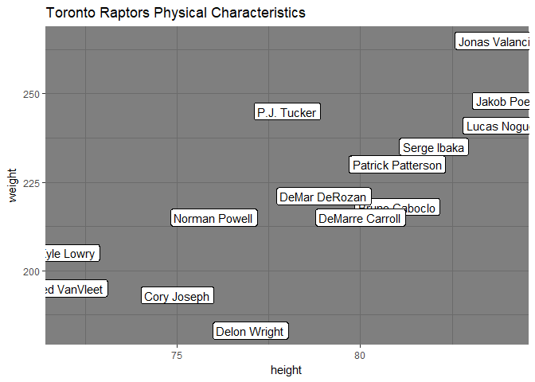

Exploratory Data Analaysis 2 with NBA Dataset Using dplyr and ggplot2
================
Hubert Luo
February 22, 2018

``` r
library(ggplot2)
library(dplyr)
```

    ## 
    ## Attaching package: 'dplyr'

    ## The following objects are masked from 'package:stats':
    ## 
    ##     filter, lag

    ## The following objects are masked from 'package:base':
    ## 
    ##     intersect, setdiff, setequal, union

``` r
library(readr)
dat <- read_csv('nba2017-players.csv')
```

    ## Parsed with column specification:
    ## cols(
    ##   player = col_character(),
    ##   team = col_character(),
    ##   position = col_character(),
    ##   height = col_integer(),
    ##   weight = col_integer(),
    ##   age = col_integer(),
    ##   experience = col_integer(),
    ##   college = col_character(),
    ##   salary = col_double(),
    ##   games = col_integer(),
    ##   minutes = col_integer(),
    ##   points = col_integer(),
    ##   points3 = col_integer(),
    ##   points2 = col_integer(),
    ##   points1 = col_integer()
    ## )

Filtering, Slicing, and Selecting (Standard and Piping Syntax)
--------------------------------------------------------------

The following commands contain 3 components: 1. Description of command 2. Command with regular syntax 3. Command with piping syntax

To reduce document size, only the command with piping syntax is knitted

``` r
#use slice() to subset the data by selecting the first 5 rows.
#slice(dat,1:5)
dat %>% slice(1:5)
```

    ## # A tibble: 5 x 15
    ##   player   team  position height weight   age experience college    salary
    ##   <chr>    <chr> <chr>     <int>  <int> <int>      <int> <chr>       <dbl>
    ## 1 Al Horf~ BOS   C            82    245    30          9 Universit~ 2.65e7
    ## 2 Amir Jo~ BOS   PF           81    240    29         11 <NA>       1.20e7
    ## 3 Avery B~ BOS   SG           74    180    26          6 Universit~ 8.27e6
    ## 4 Demetri~ BOS   PG           73    201    22          0 Universit~ 1.45e6
    ## 5 Gerald ~ BOS   SF           79    205    31          9 <NA>       1.41e6
    ## # ... with 6 more variables: games <int>, minutes <int>, points <int>,
    ## #   points3 <int>, points2 <int>, points1 <int>

``` r
#use slice() to subset the data by selecting rows 10, 15, 20, ..., 50.
#slice(dat,2:10*5)
dat %>% slice(2:10*5)
```

    ## # A tibble: 9 x 15
    ##   player   team  position height weight   age experience college    salary
    ##   <chr>    <chr> <chr>     <int>  <int> <int>      <int> <chr>       <dbl>
    ## 1 Jonas J~ BOS   PF           82    231    29          6 <NA>       5.00e6
    ## 2 Tyler Z~ BOS   C            84    253    27          4 Universit~ 8.00e6
    ## 3 Edy Tav~ CLE   C            87    260    24          1 <NA>       5.14e3
    ## 4 Kevin L~ CLE   PF           82    251    28          8 Universit~ 2.12e7
    ## 5 Tristan~ CLE   C            81    238    25          5 Universit~ 1.53e7
    ## 6 DeMarre~ TOR   SF           80    215    30          7 Universit~ 1.42e7
    ## 7 Lucas N~ TOR   C            84    241    24          2 <NA>       1.92e6
    ## 8 Serge I~ TOR   PF           82    235    27          7 <NA>       1.22e7
    ## 9 Daniel ~ WAS   C            83    245    23          0 Villanova~ 5.43e5
    ## # ... with 6 more variables: games <int>, minutes <int>, points <int>,
    ## #   points3 <int>, points2 <int>, points1 <int>

``` r
#use slice() to subset  the data by selecting the last 5 rows.
#slice(dat,(nrow(dat)-4):nrow(dat))
dat %>% slice(nrow(dat)-4:nrow(dat))
```

    ## # A tibble: 437 x 15
    ##    player  team  position height weight   age experience college    salary
    ##    <chr>   <chr> <chr>     <int>  <int> <int>      <int> <chr>       <dbl>
    ##  1 Marque~ PHO   PF           82    233    19          0 Universit~ 2.94e6
    ##  2 Leandr~ PHO   SG           75    194    34         13 <NA>       4.00e6
    ##  3 Jared ~ PHO   PF           79    225    31          9 Boston Co~ 1.05e7
    ##  4 Eric B~ PHO   PG           73    190    27          6 Universit~ 1.40e7
    ##  5 Elijah~ PHO   SG           78    225    29          2 Universit~ 2.31e4
    ##  6 Dragan~ PHO   PF           85    225    19          0 <NA>       4.28e6
    ##  7 Devin ~ PHO   SG           78    206    20          1 Universit~ 2.22e6
    ##  8 Derric~ PHO   SF           79    190    19          0 Universit~ 5.43e5
    ##  9 Brando~ PHO   SG           75    189    25          5 Universit~ 1.26e7
    ## 10 Alex L~ PHO   C            85    260    23          3 Universit~ 4.82e6
    ## # ... with 427 more rows, and 6 more variables: games <int>,
    ## #   minutes <int>, points <int>, points3 <int>, points2 <int>,
    ## #   points1 <int>

``` r
#use filter() to subset those players with height less than 70 inches tall.
#filter(dat, height < 70)
dat %>% filter(height < 70)
```

    ## # A tibble: 2 x 15
    ##   player   team  position height weight   age experience college    salary
    ##   <chr>    <chr> <chr>     <int>  <int> <int>      <int> <chr>       <dbl>
    ## 1 Isaiah ~ BOS   PG           69    185    27          5 Universit~ 6.59e6
    ## 2 Kay Fel~ CLE   PG           69    176    21          0 Oakland U~ 5.43e5
    ## # ... with 6 more variables: games <int>, minutes <int>, points <int>,
    ## #   points3 <int>, points2 <int>, points1 <int>

``` r
#use filter() to subset rows of Toronto Raptors ('TOR').
#filter(dat, team == "TOR")
dat %>% filter(team == "TOR")
```

    ## # A tibble: 15 x 15
    ##    player   team  position height weight   age experience college   salary
    ##    <chr>    <chr> <chr>     <int>  <int> <int>      <int> <chr>      <dbl>
    ##  1 Bruno C~ TOR   SF           81    218    21          2 <NA>      1.59e6
    ##  2 Cory Jo~ TOR   SG           75    193    25          5 Universi~ 7.33e6
    ##  3 Delon W~ TOR   PG           77    183    24          1 Universi~ 1.58e6
    ##  4 DeMar D~ TOR   SG           79    221    27          7 Universi~ 2.65e7
    ##  5 DeMarre~ TOR   SF           80    215    30          7 Universi~ 1.42e7
    ##  6 Fred Va~ TOR   PG           72    195    22          0 Wichita ~ 5.43e5
    ##  7 Jakob P~ TOR   C            84    248    21          0 Universi~ 2.70e6
    ##  8 Jonas V~ TOR   C            84    265    24          4 <NA>      1.44e7
    ##  9 Kyle Lo~ TOR   PG           72    205    30         10 Villanov~ 1.20e7
    ## 10 Lucas N~ TOR   C            84    241    24          2 <NA>      1.92e6
    ## 11 Norman ~ TOR   SG           76    215    23          1 Universi~ 8.75e5
    ## 12 P.J. Tu~ TOR   SF           78    245    31          5 Universi~ 5.30e6
    ## 13 Pascal ~ TOR   PF           81    230    22          0 New Mexi~ 1.20e6
    ## 14 Patrick~ TOR   PF           81    230    27          6 Universi~ 6.05e6
    ## 15 Serge I~ TOR   PF           82    235    27          7 <NA>      1.22e7
    ## # ... with 6 more variables: games <int>, minutes <int>, points <int>,
    ## #   points3 <int>, points2 <int>, points1 <int>

``` r
#use filter() to subset rows of TOR centers ('C').
#filter(dat, team == "TOR" & position == "C")
dat %>% filter(team == "TOR" & position == "C")
```

    ## # A tibble: 3 x 15
    ##   player    team  position height weight   age experience college   salary
    ##   <chr>     <chr> <chr>     <int>  <int> <int>      <int> <chr>      <dbl>
    ## 1 Jakob Po~ TOR   C            84    248    21          0 Universi~ 2.70e6
    ## 2 Jonas Va~ TOR   C            84    265    24          4 <NA>      1.44e7
    ## 3 Lucas No~ TOR   C            84    241    24          2 <NA>      1.92e6
    ## # ... with 6 more variables: games <int>, minutes <int>, points <int>,
    ## #   points3 <int>, points2 <int>, points1 <int>

``` r
#use filter() and then select(), to subset rows of lakers ('LAL'), and then display their names.
#select(filter(dat, team == "LAL"),player)
dat %>% filter(team == "LAL") %>% select(player)
```

    ## # A tibble: 15 x 1
    ##    player           
    ##    <chr>            
    ##  1 Brandon Ingram   
    ##  2 Corey Brewer     
    ##  3 D'Angelo Russell 
    ##  4 David Nwaba      
    ##  5 Ivica Zubac      
    ##  6 Jordan Clarkson  
    ##  7 Julius Randle    
    ##  8 Larry Nance Jr.  
    ##  9 Luol Deng        
    ## 10 Metta World Peace
    ## 11 Nick Young       
    ## 12 Tarik Black      
    ## 13 Thomas Robinson  
    ## 14 Timofey Mozgov   
    ## 15 Tyler Ennis

``` r
#use filter() and then select(), to display the name and salary, of TOR point guards
#select(filter(dat, team == "TOR" & position == "PG"), player, salary)
dat %>% filter(team == "TOR" & position == "PG") %>%  select(player, salary)
```

    ## # A tibble: 3 x 2
    ##   player          salary
    ##   <chr>            <dbl>
    ## 1 Delon Wright   1577280
    ## 2 Fred VanVleet   543471
    ## 3 Kyle Lowry    12000000

``` r
#select the name, age, and team, of players with more than 10 years of experience, making 10 million dollars or less.
#select(filter(dat, experience > 10 & salary <= 10e6), player, age, team)
dat %>% filter(experience > 10 & salary <= 10e6) %>% select(player, age, team)
```

    ## # A tibble: 32 x 3
    ##    player              age team 
    ##    <chr>             <int> <chr>
    ##  1 Dahntay Jones        36 CLE  
    ##  2 Deron Williams       32 CLE  
    ##  3 James Jones          36 CLE  
    ##  4 Kyle Korver          35 CLE  
    ##  5 Richard Jefferson    36 CLE  
    ##  6 Jose Calderon        35 ATL  
    ##  7 Kris Humphries       31 ATL  
    ##  8 Mike Dunleavy        36 ATL  
    ##  9 Jason Terry          39 MIL  
    ## 10 C.J. Miles           29 IND  
    ## # ... with 22 more rows

``` r
#select the name, team, height, and weight, of rookie players, 20 years old, displaying only the first five occurrences (i.e. rows)
#slice(select(filter(dat, experience == 0 & age == 20), player, team, height, weight),1:5)
dat %>% filter(experience == 0 & age == 20) %>% select(player, team, height,weight) %>% slice(1:5)
```

    ## # A tibble: 5 x 4
    ##   player            team  height weight
    ##   <chr>             <chr>  <int>  <int>
    ## 1 Jaylen Brown      BOS       79    225
    ## 2 Henry Ellenson    DET       83    245
    ## 3 Stephen Zimmerman ORL       84    240
    ## 4 Dejounte Murray   SAS       77    170
    ## 5 Chinanu Onuaku    HOU       82    245

Add New Variables by mutate and Reordering Rows by arrange
----------------------------------------------------------

``` r
#Create data frame of only players from the Toronto Raptors
tor <- filter(dat, team == 'TOR')
tor
```

    ## # A tibble: 15 x 15
    ##    player   team  position height weight   age experience college   salary
    ##    <chr>    <chr> <chr>     <int>  <int> <int>      <int> <chr>      <dbl>
    ##  1 Bruno C~ TOR   SF           81    218    21          2 <NA>      1.59e6
    ##  2 Cory Jo~ TOR   SG           75    193    25          5 Universi~ 7.33e6
    ##  3 Delon W~ TOR   PG           77    183    24          1 Universi~ 1.58e6
    ##  4 DeMar D~ TOR   SG           79    221    27          7 Universi~ 2.65e7
    ##  5 DeMarre~ TOR   SF           80    215    30          7 Universi~ 1.42e7
    ##  6 Fred Va~ TOR   PG           72    195    22          0 Wichita ~ 5.43e5
    ##  7 Jakob P~ TOR   C            84    248    21          0 Universi~ 2.70e6
    ##  8 Jonas V~ TOR   C            84    265    24          4 <NA>      1.44e7
    ##  9 Kyle Lo~ TOR   PG           72    205    30         10 Villanov~ 1.20e7
    ## 10 Lucas N~ TOR   C            84    241    24          2 <NA>      1.92e6
    ## 11 Norman ~ TOR   SG           76    215    23          1 Universi~ 8.75e5
    ## 12 P.J. Tu~ TOR   SF           78    245    31          5 Universi~ 5.30e6
    ## 13 Pascal ~ TOR   PF           81    230    22          0 New Mexi~ 1.20e6
    ## 14 Patrick~ TOR   PF           81    230    27          6 Universi~ 6.05e6
    ## 15 Serge I~ TOR   PF           82    235    27          7 <NA>      1.22e7
    ## # ... with 6 more variables: games <int>, minutes <int>, points <int>,
    ## #   points3 <int>, points2 <int>, points1 <int>

``` r
#Add column of height/weight
tor2 = mutate(tor, ht_wt = height/weight)
tor2
```

    ## # A tibble: 15 x 16
    ##    player   team  position height weight   age experience college   salary
    ##    <chr>    <chr> <chr>     <int>  <int> <int>      <int> <chr>      <dbl>
    ##  1 Bruno C~ TOR   SF           81    218    21          2 <NA>      1.59e6
    ##  2 Cory Jo~ TOR   SG           75    193    25          5 Universi~ 7.33e6
    ##  3 Delon W~ TOR   PG           77    183    24          1 Universi~ 1.58e6
    ##  4 DeMar D~ TOR   SG           79    221    27          7 Universi~ 2.65e7
    ##  5 DeMarre~ TOR   SF           80    215    30          7 Universi~ 1.42e7
    ##  6 Fred Va~ TOR   PG           72    195    22          0 Wichita ~ 5.43e5
    ##  7 Jakob P~ TOR   C            84    248    21          0 Universi~ 2.70e6
    ##  8 Jonas V~ TOR   C            84    265    24          4 <NA>      1.44e7
    ##  9 Kyle Lo~ TOR   PG           72    205    30         10 Villanov~ 1.20e7
    ## 10 Lucas N~ TOR   C            84    241    24          2 <NA>      1.92e6
    ## 11 Norman ~ TOR   SG           76    215    23          1 Universi~ 8.75e5
    ## 12 P.J. Tu~ TOR   SF           78    245    31          5 Universi~ 5.30e6
    ## 13 Pascal ~ TOR   PF           81    230    22          0 New Mexi~ 1.20e6
    ## 14 Patrick~ TOR   PF           81    230    27          6 Universi~ 6.05e6
    ## 15 Serge I~ TOR   PF           82    235    27          7 <NA>      1.22e7
    ## # ... with 7 more variables: games <int>, minutes <int>, points <int>,
    ## #   points3 <int>, points2 <int>, points1 <int>, ht_wt <dbl>

``` r
#Arrange by height, ascending and descending
arrange(tor, height)
```

    ## # A tibble: 15 x 15
    ##    player   team  position height weight   age experience college   salary
    ##    <chr>    <chr> <chr>     <int>  <int> <int>      <int> <chr>      <dbl>
    ##  1 Fred Va~ TOR   PG           72    195    22          0 Wichita ~ 5.43e5
    ##  2 Kyle Lo~ TOR   PG           72    205    30         10 Villanov~ 1.20e7
    ##  3 Cory Jo~ TOR   SG           75    193    25          5 Universi~ 7.33e6
    ##  4 Norman ~ TOR   SG           76    215    23          1 Universi~ 8.75e5
    ##  5 Delon W~ TOR   PG           77    183    24          1 Universi~ 1.58e6
    ##  6 P.J. Tu~ TOR   SF           78    245    31          5 Universi~ 5.30e6
    ##  7 DeMar D~ TOR   SG           79    221    27          7 Universi~ 2.65e7
    ##  8 DeMarre~ TOR   SF           80    215    30          7 Universi~ 1.42e7
    ##  9 Bruno C~ TOR   SF           81    218    21          2 <NA>      1.59e6
    ## 10 Pascal ~ TOR   PF           81    230    22          0 New Mexi~ 1.20e6
    ## 11 Patrick~ TOR   PF           81    230    27          6 Universi~ 6.05e6
    ## 12 Serge I~ TOR   PF           82    235    27          7 <NA>      1.22e7
    ## 13 Jakob P~ TOR   C            84    248    21          0 Universi~ 2.70e6
    ## 14 Jonas V~ TOR   C            84    265    24          4 <NA>      1.44e7
    ## 15 Lucas N~ TOR   C            84    241    24          2 <NA>      1.92e6
    ## # ... with 6 more variables: games <int>, minutes <int>, points <int>,
    ## #   points3 <int>, points2 <int>, points1 <int>

``` r
arrange(tor,desc(height))
```

    ## # A tibble: 15 x 15
    ##    player   team  position height weight   age experience college   salary
    ##    <chr>    <chr> <chr>     <int>  <int> <int>      <int> <chr>      <dbl>
    ##  1 Jakob P~ TOR   C            84    248    21          0 Universi~ 2.70e6
    ##  2 Jonas V~ TOR   C            84    265    24          4 <NA>      1.44e7
    ##  3 Lucas N~ TOR   C            84    241    24          2 <NA>      1.92e6
    ##  4 Serge I~ TOR   PF           82    235    27          7 <NA>      1.22e7
    ##  5 Bruno C~ TOR   SF           81    218    21          2 <NA>      1.59e6
    ##  6 Pascal ~ TOR   PF           81    230    22          0 New Mexi~ 1.20e6
    ##  7 Patrick~ TOR   PF           81    230    27          6 Universi~ 6.05e6
    ##  8 DeMarre~ TOR   SF           80    215    30          7 Universi~ 1.42e7
    ##  9 DeMar D~ TOR   SG           79    221    27          7 Universi~ 2.65e7
    ## 10 P.J. Tu~ TOR   SF           78    245    31          5 Universi~ 5.30e6
    ## 11 Delon W~ TOR   PG           77    183    24          1 Universi~ 1.58e6
    ## 12 Norman ~ TOR   SG           76    215    23          1 Universi~ 8.75e5
    ## 13 Cory Jo~ TOR   SG           75    193    25          5 Universi~ 7.33e6
    ## 14 Fred Va~ TOR   PG           72    195    22          0 Wichita ~ 5.43e5
    ## 15 Kyle Lo~ TOR   PG           72    205    30         10 Villanov~ 1.20e7
    ## # ... with 6 more variables: games <int>, minutes <int>, points <int>,
    ## #   points3 <int>, points2 <int>, points1 <int>

``` r
#using the data frame tor, add a new variable product with the product of height and weight and show the 5 players with lowest product
tor %>% mutate(product = height*weight) %>% arrange(product) %>% select(player,position,product) %>% slice(1:5)
```

    ## # A tibble: 5 x 3
    ##   player        position product
    ##   <chr>         <chr>      <int>
    ## 1 Fred VanVleet PG         14040
    ## 2 Delon Wright  PG         14091
    ## 3 Cory Joseph   SG         14475
    ## 4 Kyle Lowry    PG         14760
    ## 5 Norman Powell SG         16340

``` r
#create a new data frame gsw3, by adding columns log_height and log_weight with the log transformations of height and weight.
tor3 = mutate(tor, log_height = log(height), log_weight = log(weight))

#use the original data frame to filter() and arrange() those players with height less than 71 inches tall, in increasing order.
#arrange(filter(dat, height < 71),height)
dat %>% filter(height < 71) %>% arrange(height)
```

    ## # A tibble: 3 x 15
    ##   player   team  position height weight   age experience college    salary
    ##   <chr>    <chr> <chr>     <int>  <int> <int>      <int> <chr>       <dbl>
    ## 1 Isaiah ~ BOS   PG           69    185    27          5 Universit~ 6.59e6
    ## 2 Kay Fel~ CLE   PG           69    176    21          0 Oakland U~ 5.43e5
    ## 3 Tyler U~ PHO   PG           70    150    21          0 Universit~ 9.18e5
    ## # ... with 6 more variables: games <int>, minutes <int>, points <int>,
    ## #   points3 <int>, points2 <int>, points1 <int>

``` r
#display the name, team, and salary, of the top-5 highest paid players
#select(slice(arrange(dat, desc(salary)),1:5),c(player, team, salary))
dat %>% arrange(desc(salary)) %>% slice(1:5) %>% select(player, team, salary)
```

    ## # A tibble: 5 x 3
    ##   player        team    salary
    ##   <chr>         <chr>    <dbl>
    ## 1 LeBron James  CLE   30963450
    ## 2 Al Horford    BOS   26540100
    ## 3 DeMar DeRozan TOR   26540100
    ## 4 Kevin Durant  GSW   26540100
    ## 5 James Harden  HOU   26540100

``` r
#display the name, team, and points3, of the top 10 three-point players
#select(slice(arrange(dat, desc(points3)),1:10),c(player, team, points3))
dat %>% arrange(desc(points3)) %>% slice(1:10) %>% select(player, team, points3)
```

    ## # A tibble: 10 x 3
    ##    player         team  points3
    ##    <chr>          <chr>   <int>
    ##  1 Stephen Curry  GSW       324
    ##  2 Klay Thompson  GSW       268
    ##  3 James Harden   HOU       262
    ##  4 Eric Gordon    HOU       246
    ##  5 Isaiah Thomas  BOS       245
    ##  6 Kemba Walker   CHO       240
    ##  7 Bradley Beal   WAS       223
    ##  8 Damian Lillard POR       214
    ##  9 Ryan Anderson  HOU       204
    ## 10 J.J. Redick    LAC       201

``` r
#create a data frame tor_mpg of Toronto Raptors players, that contains variables for player name, experience, and min_per_game (minutes per game), sorted by min_per_game (in descending order)
#tor_mpg = arrange(select(mutate(filter(dat,team=="TOR"),min_per_game = minutes/games),c(player, experience, min_per_game)),desc(min_per_game))
tor_mpg = dat %>% filter(team=='TOR') %>% mutate(min_per_game = minutes/games) %>% select(player, experience, min_per_game) %>% arrange(desc(min_per_game))
tor_mpg
```

    ## # A tibble: 15 x 3
    ##    player            experience min_per_game
    ##    <chr>                  <int>        <dbl>
    ##  1 Kyle Lowry                10        37.4 
    ##  2 DeMar DeRozan              7        35.4 
    ##  3 Serge Ibaka                7        31.0 
    ##  4 DeMarre Carroll            7        26.1 
    ##  5 Jonas Valanciunas          4        25.8 
    ##  6 P.J. Tucker                5        25.4 
    ##  7 Cory Joseph                5        25.0 
    ##  8 Patrick Patterson          6        24.6 
    ##  9 Lucas Nogueira             2        19.1 
    ## 10 Norman Powell              1        18.0 
    ## 11 Delon Wright               1        16.5 
    ## 12 Pascal Siakam              0        15.6 
    ## 13 Jakob Poeltl               0        11.6 
    ## 14 Fred VanVleet              0         7.95
    ## 15 Bruno Caboclo              2         4.44

### Summarizing values with summarise and Grouped Operations

``` r
# average salary of NBA players
summarise(dat, avg_salary = mean(salary))
```

    ## # A tibble: 1 x 1
    ##   avg_salary
    ##        <dbl>
    ## 1    6187014

``` r
#use summarise() to get the largest height value.
summarise(dat,max_height = max(height))
```

    ## # A tibble: 1 x 1
    ##   max_height
    ##        <dbl>
    ## 1       87.0

``` r
#use summarise() to get the standard deviation of points3.
summarise(dat,sd_3pt = sd(points3))
```

    ## # A tibble: 1 x 1
    ##   sd_3pt
    ##    <dbl>
    ## 1   56.0

``` r
#use summarise() and group_by() to display the median of three-points, by team.
#summarise(group_by(dat, team),median_3pt = median(points3))
dat %>% group_by(team) %>% summarise(median_3pt = median(points3))
```

    ## # A tibble: 30 x 2
    ##    team  median_3pt
    ##    <chr>      <dbl>
    ##  1 ATL         32.5
    ##  2 BOS         46.0
    ##  3 BRK         44.0
    ##  4 CHI         32.0
    ##  5 CHO         17.0
    ##  6 CLE         62.0
    ##  7 DAL         53.0
    ##  8 DEN         53.0
    ##  9 DET         28.0
    ## 10 GSW         18.0
    ## # ... with 20 more rows

``` r
#display the average triple points by team, in ascending order, of the bottom-5 teams (worst 3pointer teams)
#slice(arrange(summarise(group_by(dat,team),average_3pt = mean(points3)),average_3pt),1:5)
dat %>% group_by(team) %>% summarise(average_3pt = mean(points3)) %>% arrange(average_3pt) %>% slice(1:5)
```

    ## # A tibble: 5 x 2
    ##   team  average_3pt
    ##   <chr>       <dbl>
    ## 1 NOP          36.6
    ## 2 SAC          37.2
    ## 3 PHO          37.6
    ## 4 CHI          37.7
    ## 5 LAL          39.5

``` r
#obtain the mean and standard deviation of age, for Power Forwards, with 5 and 10 years (including) years of experience.
#summarise(filter(dat, position =="PF" & experience>=5 & experience <= 10),average_age = mean(age), sd_age = sd(age))
dat %>% filter(position == "PF" & experience >= 5 & experience <= 10) %>% summarise(average_age = mean(age), sd_age = sd(age))
```

    ## # A tibble: 1 x 2
    ##   average_age sd_age
    ##         <dbl>  <dbl>
    ## 1        28.1   1.80

### More Dataframe Manipulation

``` r
#Display those rows associated to players having height less than 70 inches tall.
#show(dat[dat$height<70,])
dat %>% filter(height < 70)
```

    ## # A tibble: 2 x 15
    ##   player   team  position height weight   age experience college    salary
    ##   <chr>    <chr> <chr>     <int>  <int> <int>      <int> <chr>       <dbl>
    ## 1 Isaiah ~ BOS   PG           69    185    27          5 Universit~ 6.59e6
    ## 2 Kay Fel~ CLE   PG           69    176    21          0 Oakland U~ 5.43e5
    ## # ... with 6 more variables: games <int>, minutes <int>, points <int>,
    ## #   points3 <int>, points2 <int>, points1 <int>

``` r
#Display the names and salaries of centres with over 10 years of playing experience
#show(dat[dat$position=='C' & dat$experience > 10,c('player','salary')])
dat %>% filter(position == 'C' & experience > 10) %>% select(player, salary)
```

    ## # A tibble: 7 x 2
    ##   player           salary
    ##   <chr>             <dbl>
    ## 1 Dwight Howard  23180275
    ## 2 Al Jefferson   10230179
    ## 3 Udonis Haslem   4000000
    ## 4 David West      1551659
    ## 5 Zaza Pachulia   2898000
    ## 6 Pau Gasol      15500000
    ## 7 Tyson Chandler 12415000

``` r
#Create a data frame UCLA with the data of players from college UCLA ("University of California, Los Angeles").
#ucla <- data.frame(dat[dat$college == "University of California, Los Angeles",])
ucla <- dat%>%filter(college == "University of California, Los Angeles")

#Create a data frame rookies with those players with 0 years of experience.
#rookies <- data.frame(dat[dat$experience == 0,])
rookies <- dat%>%filter(experience==0)

#Create a data frame rookie_centers with the data of Center rookie players.
#rookie_centres <- data.frame(rookies[rookies$position == 'C',])
rookie_centres <- rookies%>%filter(position=='C')

#Create a data frame top_players for players with more than 50 games and more than 300 minutes played.
#top_players <- dat[(dat$games > 50) & (dat$minutes > 300),]
top_players <- dat%>%filter(games>50 & minutes > 300)

#What's the largest height value?
#max(dat$height)
dat %>% summarise(max(height))
```

    ## # A tibble: 1 x 1
    ##   `max(height)`
    ##           <dbl>
    ## 1          87.0

``` r
#What's the minimum height value?
#min(dat$height)
dat %>% summarise(min(height))
```

    ## # A tibble: 1 x 1
    ##   `min(height)`
    ##           <dbl>
    ## 1          69.0

``` r
#What's the overall average height?
#mean(dat$height)
dat %>% summarise(mean(height))
```

    ## # A tibble: 1 x 1
    ##   `mean(height)`
    ##            <dbl>
    ## 1           79.2

``` r
#Who is the tallest player?
#dat[dat$height == max(dat$height),'player']
dat %>% arrange(desc(height)) %>% select(player) %>% slice(1)
```

    ## # A tibble: 1 x 1
    ##   player     
    ##   <chr>      
    ## 1 Edy Tavares

``` r
#Who is the shortest player?
#dat[dat$height == min(dat$height),'player']
dat %>% arrange(height) %>% select(player) %>% slice(1)
```

    ## # A tibble: 1 x 1
    ##   player       
    ##   <chr>        
    ## 1 Isaiah Thomas

``` r
#Which are the unique teams?
#unique(dat$team)
dat %>% distinct(team)
```

    ## # A tibble: 30 x 1
    ##    team 
    ##    <chr>
    ##  1 BOS  
    ##  2 CLE  
    ##  3 TOR  
    ##  4 WAS  
    ##  5 ATL  
    ##  6 MIL  
    ##  7 IND  
    ##  8 CHI  
    ##  9 MIA  
    ## 10 DET  
    ## # ... with 20 more rows

``` r
#How many different teams?
#length(unique(dat$team))
dat %>% distinct(team) %>% nrow
```

    ## [1] 30

``` r
#Who is the oldest player?
#dat[dat$age == max(dat$age),'player']
dat %>% arrange(desc(age)) %>%  select(player) %>% slice(1)
```

    ## # A tibble: 1 x 1
    ##   player      
    ##   <chr>       
    ## 1 Vince Carter

``` r
#What is the median salary of all players?
#median(dat$salary)
dat %>% summarise(median(salary))
```

    ## # A tibble: 1 x 1
    ##   `median(salary)`
    ##              <dbl>
    ## 1          3500000

``` r
#What is the median salary of the players with 10 years of experience or more?
#median(dat[dat$experience >= 10, 'salary'][[1]])
dat %>% filter(experience >= 10) %>% summarise(median(salary))
```

    ## # A tibble: 1 x 1
    ##   `median(salary)`
    ##              <dbl>
    ## 1          5644034

``` r
#What is the median salary of Shooting Guards (SG) and Point Guards (PG)?
#median(dat[(dat$position == 'PG') | (dat$position == 'SG'),'salary'][[1]])
dat %>% filter(position %in% c('PG','SG')) %>% summarise(median(salary))
```

    ## # A tibble: 1 x 1
    ##   `median(salary)`
    ##              <dbl>
    ## 1          3230690

``` r
#What is the median salary of Power Forwards (PF), 29 years or older, and 74 inches tall or less?
#median(dat[(dat$position == 'PF') & (dat$age >= 29) & (dat$height <= 74),'salary'][[1]])
dat %>% filter(position == 'PG' & age >= 29 & height <= 74) %>% summarise(median(salary))
```

    ## # A tibble: 1 x 1
    ##   `median(salary)`
    ##              <dbl>
    ## 1          4770262

``` r
#How many players are from "University of California, Berkeley"?
#nrow(na.omit(dat[dat$college == "University of California, Berkeley",]))
dat %>% filter(college == "University of California, Berkeley") %>% nrow
```

    ## [1] 0

``` r
#Are there any players with weight greater than 260 pounds? If so how many and who are they?
#nrow(dat[dat$weight > 260,])
#dat[dat$weight > 260,'player']
dat %>% filter(weight > 260) %>% select('player')
```

    ## # A tibble: 21 x 1
    ##    player           
    ##    <chr>            
    ##  1 Jonas Valanciunas
    ##  2 Dwight Howard    
    ##  3 Greg Monroe      
    ##  4 Al Jefferson     
    ##  5 Kevin Seraphin   
    ##  6 Cristiano Felicio
    ##  7 Hassan Whiteside 
    ##  8 Andre Drummond   
    ##  9 Boban Marjanovic 
    ## 10 Jahlil Okafor    
    ## # ... with 11 more rows

``` r
#How many players did not attend a college in the US?
#nrow(dat[is.na(dat$college),])
dat %>% filter(is.na(college)) %>% nrow
```

    ## [1] 85

``` r
#Who is the player with the maximum rate of points per minute?
#dat[dat$points/dat$minutes == max(dat$points/dat$minutes),'player']
dat %>% arrange(desc(points/minutes)) %>% select(player) %>% slice(1)
```

    ## # A tibble: 1 x 1
    ##   player           
    ##   <chr>            
    ## 1 Russell Westbrook

``` r
#Who is the player with the maximum rate of 3 pointers per minute?
#dat[dat$points3/dat$minutes == max(dat$points3/dat$minutes),'player']
dat %>% arrange(desc(points3/minutes)) %>% select(player) %>% slice(1)
```

    ## # A tibble: 1 x 1
    ##   player       
    ##   <chr>        
    ## 1 Stephen Curry

### Grouping the Data

``` r
#Create a data frame with the average height, average weight, and average age, grouped by position
#aggregate(dat[,c("height","weight","age")],by = list(dat$age),FUN = mean)
dat %>% group_by(position) %>% summarise(mean(height),mean(weight),mean(age))
```

    ## # A tibble: 5 x 4
    ##   position `mean(height)` `mean(weight)` `mean(age)`
    ##   <chr>             <dbl>          <dbl>       <dbl>
    ## 1 C                  83.3            251        25.9
    ## 2 PF                 81.5            236        25.9
    ## 3 PG                 74.3            189        26.4
    ## 4 SF                 79.6            220        27.1
    ## 5 SG                 77.0            205        26.2

``` r
#Create a data frame with the average height, average weight, and average age, grouped by team
#aggregate(dat[,c("height","weight","age")],by = list(dat$team),FUN = mean)
dat %>% group_by(team) %>% summarise(mean(height),mean(weight),mean(age))
```

    ## # A tibble: 30 x 4
    ##    team  `mean(height)` `mean(weight)` `mean(age)`
    ##    <chr>          <dbl>          <dbl>       <dbl>
    ##  1 ATL             79.1            220        28.4
    ##  2 BOS             78.2            220        25.3
    ##  3 BRK             78.7            222        25.5
    ##  4 CHI             78.5            216        25.8
    ##  5 CHO             78.8            213        25.9
    ##  6 CLE             78.9            226        29.6
    ##  7 DAL             79.1            216        26.9
    ##  8 DEN             79.4            220        25.8
    ##  9 DET             79.5            228        25.5
    ## 10 GSW             79.9            224        27.7
    ## # ... with 20 more rows

``` r
#Create a data frame with the average height, average weight, and average age, grouped by team and position.
#aggregate(dat[,c("height","weight","age")],by = list(dat$team, dat$position),FUN = mean)
dat %>% group_by(position, team) %>% summarise(mean(height),mean(weight),mean(age))
```

    ## # A tibble: 150 x 5
    ## # Groups:   position [?]
    ##    position team  `mean(height)` `mean(weight)` `mean(age)`
    ##    <chr>    <chr>          <dbl>          <dbl>       <dbl>
    ##  1 C        ATL             83.0            252        28.0
    ##  2 C        BOS             83.3            245        27.3
    ##  3 C        BRK             84.0            268        27.0
    ##  4 C        CHI             83.0            250        25.7
    ##  5 C        CHO             83.5            246        25.5
    ##  6 C        CLE             83.7            251        27.3
    ##  7 C        DAL             83.8            243        25.2
    ##  8 C        DEN             83.7            255        25.7
    ##  9 C        DET             84.0            276        27.0
    ## 10 C        GSW             82.6            251        27.6
    ## # ... with 140 more rows

``` r
#Create a data frame with the minimum salary, median salary, mean salary, and maximum salary, grouped by team and position.
#nba_summary <- data.frame(aggregate(dat[,c("salary")],by = list(dat$team, dat$position),FUN = min), 
#           aggregate(dat[,c("salary")],by = list(dat$team, dat$position),FUN = median),
#           aggregate(dat[,c("salary")],by = list(dat$team, dat$position),FUN = mean),
#           aggregate(dat[,c("salary")],by = list(dat$team, dat$position),FUN = max))[,c(1,2,3,6,9,12)]
#colnames(nba_summary) <- c("Team","Position","Min Salary", "Median Salary", "Mean Salary", "Max Salary")
#nba_summary
dat %>% group_by(position, team) %>% summarise(min(salary),median(salary),mean(salary),max(salary))
```

    ## # A tibble: 150 x 6
    ## # Groups:   position [?]
    ##    position team  `min(salary)` `median(salary)` `mean(salary)`
    ##    <chr>    <chr>         <dbl>            <dbl>          <dbl>
    ##  1 C        ATL         1015696         12097986       12097986
    ##  2 C        BOS         3094014          8000000       12544705
    ##  3 C        BRK         3000000         12082838       12082838
    ##  4 C        CHI          874636          1709720        5267869
    ##  5 C        CHO         2730000          7615000        7615000
    ##  6 C        CLE            5145          7806971        7714184
    ##  7 C        DAL          650000          2629563        3571032
    ##  8 C        DEN         1358500          2328530        2895677
    ##  9 C        DET         6500000          7000000       11872250
    ## 10 C        GSW         1171560          1403611        1641534
    ## # ... with 140 more rows, and 1 more variable: `max(salary)` <dbl>

### Visualizations with ggplot2

``` r
# scatterplot (option 1)
ggplot(data = dat, aes(x = points, y = salary)) +
  geom_point() + 
  ggtitle('Relationship between Points and Salary of NBA Players') +
  geom_smooth(method = lm) +
  theme_bw()
```



``` r
# colored scatterplot 
ggplot(data = dat, aes(x = points, y = salary, color = position)) +
  geom_point() +
  ggtitle("Relationship between Points and Salary of NBA Players by Position") +
  geom_smooth(method = "lm", se = FALSE) #Remove confidence intervals so easier to see lines
```


``` r
# sized and colored scatterplot 
ggplot(data = dat, aes(x = points, y = salary, color = position, size = points3)) +
  geom_point(alpha = 0.5) +
  ggtitle("Points and Salaries of NBA Players by Position and Number of 3-Pointers") +
  theme_gray()
```


``` r
#Use the data frame tor to make a scatterplot of height and weight.
ggplot(data = tor, aes(x = height, y = weight, label = player)) +
  geom_label() + 
  ggtitle('Toronto Raptors Physical Characteristics') +
  theme_dark()
```



``` r
ggplot(data = dat, aes(x = points, y = salary, color = position)) +
  facet_grid(.~position) + #Facet by position vertically
  geom_point(show.legend = FALSE) + #No need for legend since colours seperated by facets and under position header
  ggtitle('Relationship between Points and Salary for each Position') +
  geom_smooth(method = lm, show.legend= FALSE) +
  theme_classic()
```


``` r
ggplot(data = dat, aes(x = weight, y = height)) +
  facet_grid(.~position) +
  geom_density2d() +
  theme_minimal()
```


