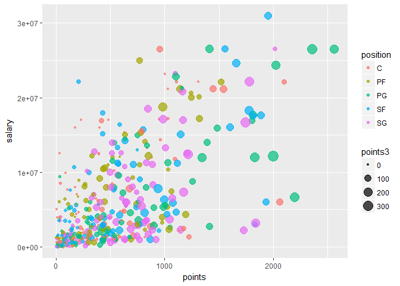

Exploratory Data Analaysis 2 with NBA Dataset (Using ggplot and dplyr)
================
Hubert Luo
February 22, 2018

``` r
library(ggplot2)
library(dplyr)
```

    ## 
    ## Attaching package: 'dplyr'

    ## The following objects are masked from 'package:stats':
    ## 
    ##     filter, lag

    ## The following objects are masked from 'package:base':
    ## 
    ##     intersect, setdiff, setequal, union

``` r
library(readr)
dat <- read_csv('nba2017-players.csv')
```

    ## Parsed with column specification:
    ## cols(
    ##   player = col_character(),
    ##   team = col_character(),
    ##   position = col_character(),
    ##   height = col_integer(),
    ##   weight = col_integer(),
    ##   age = col_integer(),
    ##   experience = col_integer(),
    ##   college = col_character(),
    ##   salary = col_double(),
    ##   games = col_integer(),
    ##   minutes = col_integer(),
    ##   points = col_integer(),
    ##   points3 = col_integer(),
    ##   points2 = col_integer(),
    ##   points1 = col_integer()
    ## )

Filtering, Slicing, and Selecting (Standard and Piping Syntax)
--------------------------------------------------------------

The following commands contain 3 components: 1. Description of command 2. Command with regular syntax 3. Command with piping syntax

``` r
#use slice() to subset the data by selecting the first 5 rows.
slice(dat,1:5)
```

    ## # A tibble: 5 x 15
    ##   player   team  position height weight   age experience college    salary
    ##   <chr>    <chr> <chr>     <int>  <int> <int>      <int> <chr>       <dbl>
    ## 1 Al Horf~ BOS   C            82    245    30          9 Universit~ 2.65e7
    ## 2 Amir Jo~ BOS   PF           81    240    29         11 <NA>       1.20e7
    ## 3 Avery B~ BOS   SG           74    180    26          6 Universit~ 8.27e6
    ## 4 Demetri~ BOS   PG           73    201    22          0 Universit~ 1.45e6
    ## 5 Gerald ~ BOS   SF           79    205    31          9 <NA>       1.41e6
    ## # ... with 6 more variables: games <int>, minutes <int>, points <int>,
    ## #   points3 <int>, points2 <int>, points1 <int>

``` r
dat %>% slice(1:5)
```

    ## # A tibble: 5 x 15
    ##   player   team  position height weight   age experience college    salary
    ##   <chr>    <chr> <chr>     <int>  <int> <int>      <int> <chr>       <dbl>
    ## 1 Al Horf~ BOS   C            82    245    30          9 Universit~ 2.65e7
    ## 2 Amir Jo~ BOS   PF           81    240    29         11 <NA>       1.20e7
    ## 3 Avery B~ BOS   SG           74    180    26          6 Universit~ 8.27e6
    ## 4 Demetri~ BOS   PG           73    201    22          0 Universit~ 1.45e6
    ## 5 Gerald ~ BOS   SF           79    205    31          9 <NA>       1.41e6
    ## # ... with 6 more variables: games <int>, minutes <int>, points <int>,
    ## #   points3 <int>, points2 <int>, points1 <int>

``` r
#use slice() to subset the data by selecting rows 10, 15, 20, ..., 50.
slice(dat,2:10*5)
```

    ## # A tibble: 9 x 15
    ##   player   team  position height weight   age experience college    salary
    ##   <chr>    <chr> <chr>     <int>  <int> <int>      <int> <chr>       <dbl>
    ## 1 Jonas J~ BOS   PF           82    231    29          6 <NA>       5.00e6
    ## 2 Tyler Z~ BOS   C            84    253    27          4 Universit~ 8.00e6
    ## 3 Edy Tav~ CLE   C            87    260    24          1 <NA>       5.14e3
    ## 4 Kevin L~ CLE   PF           82    251    28          8 Universit~ 2.12e7
    ## 5 Tristan~ CLE   C            81    238    25          5 Universit~ 1.53e7
    ## 6 DeMarre~ TOR   SF           80    215    30          7 Universit~ 1.42e7
    ## 7 Lucas N~ TOR   C            84    241    24          2 <NA>       1.92e6
    ## 8 Serge I~ TOR   PF           82    235    27          7 <NA>       1.22e7
    ## 9 Daniel ~ WAS   C            83    245    23          0 Villanova~ 5.43e5
    ## # ... with 6 more variables: games <int>, minutes <int>, points <int>,
    ## #   points3 <int>, points2 <int>, points1 <int>

``` r
dat %>% slice(2:10*5)
```

    ## # A tibble: 9 x 15
    ##   player   team  position height weight   age experience college    salary
    ##   <chr>    <chr> <chr>     <int>  <int> <int>      <int> <chr>       <dbl>
    ## 1 Jonas J~ BOS   PF           82    231    29          6 <NA>       5.00e6
    ## 2 Tyler Z~ BOS   C            84    253    27          4 Universit~ 8.00e6
    ## 3 Edy Tav~ CLE   C            87    260    24          1 <NA>       5.14e3
    ## 4 Kevin L~ CLE   PF           82    251    28          8 Universit~ 2.12e7
    ## 5 Tristan~ CLE   C            81    238    25          5 Universit~ 1.53e7
    ## 6 DeMarre~ TOR   SF           80    215    30          7 Universit~ 1.42e7
    ## 7 Lucas N~ TOR   C            84    241    24          2 <NA>       1.92e6
    ## 8 Serge I~ TOR   PF           82    235    27          7 <NA>       1.22e7
    ## 9 Daniel ~ WAS   C            83    245    23          0 Villanova~ 5.43e5
    ## # ... with 6 more variables: games <int>, minutes <int>, points <int>,
    ## #   points3 <int>, points2 <int>, points1 <int>

``` r
#use slice() to subset  the data by selecting the last 5 rows.
slice(dat,(nrow(dat)-4):nrow(dat))
```

    ## # A tibble: 5 x 15
    ##   player   team  position height weight   age experience college    salary
    ##   <chr>    <chr> <chr>     <int>  <int> <int>      <int> <chr>       <dbl>
    ## 1 Marques~ PHO   PF           82    233    19          0 Universit~ 2.94e6
    ## 2 Ronnie ~ PHO   PG           74    190    33         11 Utah Vall~ 2.83e5
    ## 3 T.J. Wa~ PHO   SF           80    230    23          2 North Car~ 2.13e6
    ## 4 Tyler U~ PHO   PG           70    150    21          0 Universit~ 9.18e5
    ## 5 Tyson C~ PHO   C            85    240    34         15 <NA>       1.24e7
    ## # ... with 6 more variables: games <int>, minutes <int>, points <int>,
    ## #   points3 <int>, points2 <int>, points1 <int>

``` r
dat %>% slice(nrow(dat)-4:nrow(dat))
```

    ## # A tibble: 437 x 15
    ##    player  team  position height weight   age experience college    salary
    ##    <chr>   <chr> <chr>     <int>  <int> <int>      <int> <chr>       <dbl>
    ##  1 Marque~ PHO   PF           82    233    19          0 Universit~ 2.94e6
    ##  2 Leandr~ PHO   SG           75    194    34         13 <NA>       4.00e6
    ##  3 Jared ~ PHO   PF           79    225    31          9 Boston Co~ 1.05e7
    ##  4 Eric B~ PHO   PG           73    190    27          6 Universit~ 1.40e7
    ##  5 Elijah~ PHO   SG           78    225    29          2 Universit~ 2.31e4
    ##  6 Dragan~ PHO   PF           85    225    19          0 <NA>       4.28e6
    ##  7 Devin ~ PHO   SG           78    206    20          1 Universit~ 2.22e6
    ##  8 Derric~ PHO   SF           79    190    19          0 Universit~ 5.43e5
    ##  9 Brando~ PHO   SG           75    189    25          5 Universit~ 1.26e7
    ## 10 Alex L~ PHO   C            85    260    23          3 Universit~ 4.82e6
    ## # ... with 427 more rows, and 6 more variables: games <int>,
    ## #   minutes <int>, points <int>, points3 <int>, points2 <int>,
    ## #   points1 <int>

``` r
#use filter() to subset those players with height less than 70 inches tall.
filter(dat, height < 70)
```

    ## # A tibble: 2 x 15
    ##   player   team  position height weight   age experience college    salary
    ##   <chr>    <chr> <chr>     <int>  <int> <int>      <int> <chr>       <dbl>
    ## 1 Isaiah ~ BOS   PG           69    185    27          5 Universit~ 6.59e6
    ## 2 Kay Fel~ CLE   PG           69    176    21          0 Oakland U~ 5.43e5
    ## # ... with 6 more variables: games <int>, minutes <int>, points <int>,
    ## #   points3 <int>, points2 <int>, points1 <int>

``` r
dat %>% filter(height < 70)
```

    ## # A tibble: 2 x 15
    ##   player   team  position height weight   age experience college    salary
    ##   <chr>    <chr> <chr>     <int>  <int> <int>      <int> <chr>       <dbl>
    ## 1 Isaiah ~ BOS   PG           69    185    27          5 Universit~ 6.59e6
    ## 2 Kay Fel~ CLE   PG           69    176    21          0 Oakland U~ 5.43e5
    ## # ... with 6 more variables: games <int>, minutes <int>, points <int>,
    ## #   points3 <int>, points2 <int>, points1 <int>

``` r
#use filter() to subset rows of Toronto Raptors ('TOR').
filter(dat, team == "TOR")
```

    ## # A tibble: 15 x 15
    ##    player   team  position height weight   age experience college   salary
    ##    <chr>    <chr> <chr>     <int>  <int> <int>      <int> <chr>      <dbl>
    ##  1 Bruno C~ TOR   SF           81    218    21          2 <NA>      1.59e6
    ##  2 Cory Jo~ TOR   SG           75    193    25          5 Universi~ 7.33e6
    ##  3 Delon W~ TOR   PG           77    183    24          1 Universi~ 1.58e6
    ##  4 DeMar D~ TOR   SG           79    221    27          7 Universi~ 2.65e7
    ##  5 DeMarre~ TOR   SF           80    215    30          7 Universi~ 1.42e7
    ##  6 Fred Va~ TOR   PG           72    195    22          0 Wichita ~ 5.43e5
    ##  7 Jakob P~ TOR   C            84    248    21          0 Universi~ 2.70e6
    ##  8 Jonas V~ TOR   C            84    265    24          4 <NA>      1.44e7
    ##  9 Kyle Lo~ TOR   PG           72    205    30         10 Villanov~ 1.20e7
    ## 10 Lucas N~ TOR   C            84    241    24          2 <NA>      1.92e6
    ## 11 Norman ~ TOR   SG           76    215    23          1 Universi~ 8.75e5
    ## 12 P.J. Tu~ TOR   SF           78    245    31          5 Universi~ 5.30e6
    ## 13 Pascal ~ TOR   PF           81    230    22          0 New Mexi~ 1.20e6
    ## 14 Patrick~ TOR   PF           81    230    27          6 Universi~ 6.05e6
    ## 15 Serge I~ TOR   PF           82    235    27          7 <NA>      1.22e7
    ## # ... with 6 more variables: games <int>, minutes <int>, points <int>,
    ## #   points3 <int>, points2 <int>, points1 <int>

``` r
dat %>% filter(team == "TOR")
```

    ## # A tibble: 15 x 15
    ##    player   team  position height weight   age experience college   salary
    ##    <chr>    <chr> <chr>     <int>  <int> <int>      <int> <chr>      <dbl>
    ##  1 Bruno C~ TOR   SF           81    218    21          2 <NA>      1.59e6
    ##  2 Cory Jo~ TOR   SG           75    193    25          5 Universi~ 7.33e6
    ##  3 Delon W~ TOR   PG           77    183    24          1 Universi~ 1.58e6
    ##  4 DeMar D~ TOR   SG           79    221    27          7 Universi~ 2.65e7
    ##  5 DeMarre~ TOR   SF           80    215    30          7 Universi~ 1.42e7
    ##  6 Fred Va~ TOR   PG           72    195    22          0 Wichita ~ 5.43e5
    ##  7 Jakob P~ TOR   C            84    248    21          0 Universi~ 2.70e6
    ##  8 Jonas V~ TOR   C            84    265    24          4 <NA>      1.44e7
    ##  9 Kyle Lo~ TOR   PG           72    205    30         10 Villanov~ 1.20e7
    ## 10 Lucas N~ TOR   C            84    241    24          2 <NA>      1.92e6
    ## 11 Norman ~ TOR   SG           76    215    23          1 Universi~ 8.75e5
    ## 12 P.J. Tu~ TOR   SF           78    245    31          5 Universi~ 5.30e6
    ## 13 Pascal ~ TOR   PF           81    230    22          0 New Mexi~ 1.20e6
    ## 14 Patrick~ TOR   PF           81    230    27          6 Universi~ 6.05e6
    ## 15 Serge I~ TOR   PF           82    235    27          7 <NA>      1.22e7
    ## # ... with 6 more variables: games <int>, minutes <int>, points <int>,
    ## #   points3 <int>, points2 <int>, points1 <int>

``` r
#use filter() to subset rows of TOR centers ('C').
filter(dat, team == "TOR" & position == "C")
```

    ## # A tibble: 3 x 15
    ##   player    team  position height weight   age experience college   salary
    ##   <chr>     <chr> <chr>     <int>  <int> <int>      <int> <chr>      <dbl>
    ## 1 Jakob Po~ TOR   C            84    248    21          0 Universi~ 2.70e6
    ## 2 Jonas Va~ TOR   C            84    265    24          4 <NA>      1.44e7
    ## 3 Lucas No~ TOR   C            84    241    24          2 <NA>      1.92e6
    ## # ... with 6 more variables: games <int>, minutes <int>, points <int>,
    ## #   points3 <int>, points2 <int>, points1 <int>

``` r
dat %>% filter(team == "TOR" & position == "C")
```

    ## # A tibble: 3 x 15
    ##   player    team  position height weight   age experience college   salary
    ##   <chr>     <chr> <chr>     <int>  <int> <int>      <int> <chr>      <dbl>
    ## 1 Jakob Po~ TOR   C            84    248    21          0 Universi~ 2.70e6
    ## 2 Jonas Va~ TOR   C            84    265    24          4 <NA>      1.44e7
    ## 3 Lucas No~ TOR   C            84    241    24          2 <NA>      1.92e6
    ## # ... with 6 more variables: games <int>, minutes <int>, points <int>,
    ## #   points3 <int>, points2 <int>, points1 <int>

``` r
#use filter() and then select(), to subset rows of lakers ('LAL'), and then display their names.
select(filter(dat, team == "LAL"),player)
```

    ## # A tibble: 15 x 1
    ##    player           
    ##    <chr>            
    ##  1 Brandon Ingram   
    ##  2 Corey Brewer     
    ##  3 D'Angelo Russell 
    ##  4 David Nwaba      
    ##  5 Ivica Zubac      
    ##  6 Jordan Clarkson  
    ##  7 Julius Randle    
    ##  8 Larry Nance Jr.  
    ##  9 Luol Deng        
    ## 10 Metta World Peace
    ## 11 Nick Young       
    ## 12 Tarik Black      
    ## 13 Thomas Robinson  
    ## 14 Timofey Mozgov   
    ## 15 Tyler Ennis

``` r
dat %>% filter(team == "LAL") %>% select(player)
```

    ## # A tibble: 15 x 1
    ##    player           
    ##    <chr>            
    ##  1 Brandon Ingram   
    ##  2 Corey Brewer     
    ##  3 D'Angelo Russell 
    ##  4 David Nwaba      
    ##  5 Ivica Zubac      
    ##  6 Jordan Clarkson  
    ##  7 Julius Randle    
    ##  8 Larry Nance Jr.  
    ##  9 Luol Deng        
    ## 10 Metta World Peace
    ## 11 Nick Young       
    ## 12 Tarik Black      
    ## 13 Thomas Robinson  
    ## 14 Timofey Mozgov   
    ## 15 Tyler Ennis

``` r
#use filter() and then select(), to display the name and salary, of TOR point guards
select(filter(dat, team == "TOR" & position == "PG"), player, salary)
```

    ## # A tibble: 3 x 2
    ##   player          salary
    ##   <chr>            <dbl>
    ## 1 Delon Wright   1577280
    ## 2 Fred VanVleet   543471
    ## 3 Kyle Lowry    12000000

``` r
dat %>% filter(team == "TOR" & position == "PG") %>%  select(player, salary)
```

    ## # A tibble: 3 x 2
    ##   player          salary
    ##   <chr>            <dbl>
    ## 1 Delon Wright   1577280
    ## 2 Fred VanVleet   543471
    ## 3 Kyle Lowry    12000000

``` r
#select the name, age, and team, of players with more than 10 years of experience, making 10 million dollars or less.
select(filter(dat, experience > 10 & salary <= 10e6), player, age, team)
```

    ## # A tibble: 32 x 3
    ##    player              age team 
    ##    <chr>             <int> <chr>
    ##  1 Dahntay Jones        36 CLE  
    ##  2 Deron Williams       32 CLE  
    ##  3 James Jones          36 CLE  
    ##  4 Kyle Korver          35 CLE  
    ##  5 Richard Jefferson    36 CLE  
    ##  6 Jose Calderon        35 ATL  
    ##  7 Kris Humphries       31 ATL  
    ##  8 Mike Dunleavy        36 ATL  
    ##  9 Jason Terry          39 MIL  
    ## 10 C.J. Miles           29 IND  
    ## # ... with 22 more rows

``` r
dat %>% filter(experience > 10 & salary <= 10e6) %>% select(player, age, team)
```

    ## # A tibble: 32 x 3
    ##    player              age team 
    ##    <chr>             <int> <chr>
    ##  1 Dahntay Jones        36 CLE  
    ##  2 Deron Williams       32 CLE  
    ##  3 James Jones          36 CLE  
    ##  4 Kyle Korver          35 CLE  
    ##  5 Richard Jefferson    36 CLE  
    ##  6 Jose Calderon        35 ATL  
    ##  7 Kris Humphries       31 ATL  
    ##  8 Mike Dunleavy        36 ATL  
    ##  9 Jason Terry          39 MIL  
    ## 10 C.J. Miles           29 IND  
    ## # ... with 22 more rows

``` r
#select the name, team, height, and weight, of rookie players, 20 years old, displaying only the first five occurrences (i.e. rows)
slice(select(filter(dat, experience == 0 & age == 20), player, team, height, weight),1:5)
```

    ## # A tibble: 5 x 4
    ##   player            team  height weight
    ##   <chr>             <chr>  <int>  <int>
    ## 1 Jaylen Brown      BOS       79    225
    ## 2 Henry Ellenson    DET       83    245
    ## 3 Stephen Zimmerman ORL       84    240
    ## 4 Dejounte Murray   SAS       77    170
    ## 5 Chinanu Onuaku    HOU       82    245

``` r
dat %>% filter(experience == 0 & age == 20) %>% select(player, team, height,weight) %>% slice(1:5)
```

    ## # A tibble: 5 x 4
    ##   player            team  height weight
    ##   <chr>             <chr>  <int>  <int>
    ## 1 Jaylen Brown      BOS       79    225
    ## 2 Henry Ellenson    DET       83    245
    ## 3 Stephen Zimmerman ORL       84    240
    ## 4 Dejounte Murray   SAS       77    170
    ## 5 Chinanu Onuaku    HOU       82    245

Add New Variables by mutate and Reordering Rows by arrange
----------------------------------------------------------

``` r
#Create data frame of only players from the Toronto Raptors
tor <- filter(dat, team == 'TOR')
tor
```

    ## # A tibble: 15 x 15
    ##    player   team  position height weight   age experience college   salary
    ##    <chr>    <chr> <chr>     <int>  <int> <int>      <int> <chr>      <dbl>
    ##  1 Bruno C~ TOR   SF           81    218    21          2 <NA>      1.59e6
    ##  2 Cory Jo~ TOR   SG           75    193    25          5 Universi~ 7.33e6
    ##  3 Delon W~ TOR   PG           77    183    24          1 Universi~ 1.58e6
    ##  4 DeMar D~ TOR   SG           79    221    27          7 Universi~ 2.65e7
    ##  5 DeMarre~ TOR   SF           80    215    30          7 Universi~ 1.42e7
    ##  6 Fred Va~ TOR   PG           72    195    22          0 Wichita ~ 5.43e5
    ##  7 Jakob P~ TOR   C            84    248    21          0 Universi~ 2.70e6
    ##  8 Jonas V~ TOR   C            84    265    24          4 <NA>      1.44e7
    ##  9 Kyle Lo~ TOR   PG           72    205    30         10 Villanov~ 1.20e7
    ## 10 Lucas N~ TOR   C            84    241    24          2 <NA>      1.92e6
    ## 11 Norman ~ TOR   SG           76    215    23          1 Universi~ 8.75e5
    ## 12 P.J. Tu~ TOR   SF           78    245    31          5 Universi~ 5.30e6
    ## 13 Pascal ~ TOR   PF           81    230    22          0 New Mexi~ 1.20e6
    ## 14 Patrick~ TOR   PF           81    230    27          6 Universi~ 6.05e6
    ## 15 Serge I~ TOR   PF           82    235    27          7 <NA>      1.22e7
    ## # ... with 6 more variables: games <int>, minutes <int>, points <int>,
    ## #   points3 <int>, points2 <int>, points1 <int>

``` r
#Add column of height/weight
tor2 = mutate(tor, ht_wt = height/weight)
tor2
```

    ## # A tibble: 15 x 16
    ##    player   team  position height weight   age experience college   salary
    ##    <chr>    <chr> <chr>     <int>  <int> <int>      <int> <chr>      <dbl>
    ##  1 Bruno C~ TOR   SF           81    218    21          2 <NA>      1.59e6
    ##  2 Cory Jo~ TOR   SG           75    193    25          5 Universi~ 7.33e6
    ##  3 Delon W~ TOR   PG           77    183    24          1 Universi~ 1.58e6
    ##  4 DeMar D~ TOR   SG           79    221    27          7 Universi~ 2.65e7
    ##  5 DeMarre~ TOR   SF           80    215    30          7 Universi~ 1.42e7
    ##  6 Fred Va~ TOR   PG           72    195    22          0 Wichita ~ 5.43e5
    ##  7 Jakob P~ TOR   C            84    248    21          0 Universi~ 2.70e6
    ##  8 Jonas V~ TOR   C            84    265    24          4 <NA>      1.44e7
    ##  9 Kyle Lo~ TOR   PG           72    205    30         10 Villanov~ 1.20e7
    ## 10 Lucas N~ TOR   C            84    241    24          2 <NA>      1.92e6
    ## 11 Norman ~ TOR   SG           76    215    23          1 Universi~ 8.75e5
    ## 12 P.J. Tu~ TOR   SF           78    245    31          5 Universi~ 5.30e6
    ## 13 Pascal ~ TOR   PF           81    230    22          0 New Mexi~ 1.20e6
    ## 14 Patrick~ TOR   PF           81    230    27          6 Universi~ 6.05e6
    ## 15 Serge I~ TOR   PF           82    235    27          7 <NA>      1.22e7
    ## # ... with 7 more variables: games <int>, minutes <int>, points <int>,
    ## #   points3 <int>, points2 <int>, points1 <int>, ht_wt <dbl>

``` r
#Arrange by height, ascending and descending
arrange(tor, height)
```

    ## # A tibble: 15 x 15
    ##    player   team  position height weight   age experience college   salary
    ##    <chr>    <chr> <chr>     <int>  <int> <int>      <int> <chr>      <dbl>
    ##  1 Fred Va~ TOR   PG           72    195    22          0 Wichita ~ 5.43e5
    ##  2 Kyle Lo~ TOR   PG           72    205    30         10 Villanov~ 1.20e7
    ##  3 Cory Jo~ TOR   SG           75    193    25          5 Universi~ 7.33e6
    ##  4 Norman ~ TOR   SG           76    215    23          1 Universi~ 8.75e5
    ##  5 Delon W~ TOR   PG           77    183    24          1 Universi~ 1.58e6
    ##  6 P.J. Tu~ TOR   SF           78    245    31          5 Universi~ 5.30e6
    ##  7 DeMar D~ TOR   SG           79    221    27          7 Universi~ 2.65e7
    ##  8 DeMarre~ TOR   SF           80    215    30          7 Universi~ 1.42e7
    ##  9 Bruno C~ TOR   SF           81    218    21          2 <NA>      1.59e6
    ## 10 Pascal ~ TOR   PF           81    230    22          0 New Mexi~ 1.20e6
    ## 11 Patrick~ TOR   PF           81    230    27          6 Universi~ 6.05e6
    ## 12 Serge I~ TOR   PF           82    235    27          7 <NA>      1.22e7
    ## 13 Jakob P~ TOR   C            84    248    21          0 Universi~ 2.70e6
    ## 14 Jonas V~ TOR   C            84    265    24          4 <NA>      1.44e7
    ## 15 Lucas N~ TOR   C            84    241    24          2 <NA>      1.92e6
    ## # ... with 6 more variables: games <int>, minutes <int>, points <int>,
    ## #   points3 <int>, points2 <int>, points1 <int>

``` r
arrange(tor,desc(height))
```

    ## # A tibble: 15 x 15
    ##    player   team  position height weight   age experience college   salary
    ##    <chr>    <chr> <chr>     <int>  <int> <int>      <int> <chr>      <dbl>
    ##  1 Jakob P~ TOR   C            84    248    21          0 Universi~ 2.70e6
    ##  2 Jonas V~ TOR   C            84    265    24          4 <NA>      1.44e7
    ##  3 Lucas N~ TOR   C            84    241    24          2 <NA>      1.92e6
    ##  4 Serge I~ TOR   PF           82    235    27          7 <NA>      1.22e7
    ##  5 Bruno C~ TOR   SF           81    218    21          2 <NA>      1.59e6
    ##  6 Pascal ~ TOR   PF           81    230    22          0 New Mexi~ 1.20e6
    ##  7 Patrick~ TOR   PF           81    230    27          6 Universi~ 6.05e6
    ##  8 DeMarre~ TOR   SF           80    215    30          7 Universi~ 1.42e7
    ##  9 DeMar D~ TOR   SG           79    221    27          7 Universi~ 2.65e7
    ## 10 P.J. Tu~ TOR   SF           78    245    31          5 Universi~ 5.30e6
    ## 11 Delon W~ TOR   PG           77    183    24          1 Universi~ 1.58e6
    ## 12 Norman ~ TOR   SG           76    215    23          1 Universi~ 8.75e5
    ## 13 Cory Jo~ TOR   SG           75    193    25          5 Universi~ 7.33e6
    ## 14 Fred Va~ TOR   PG           72    195    22          0 Wichita ~ 5.43e5
    ## 15 Kyle Lo~ TOR   PG           72    205    30         10 Villanov~ 1.20e7
    ## # ... with 6 more variables: games <int>, minutes <int>, points <int>,
    ## #   points3 <int>, points2 <int>, points1 <int>

``` r
#using the data frame tor, add a new variable product with the product of height and weight and show the 5 players with lowest product
tor %>% mutate(product = height*weight) %>% arrange(product) %>% select(player,position,product) %>% slice(1:5)
```

    ## # A tibble: 5 x 3
    ##   player        position product
    ##   <chr>         <chr>      <int>
    ## 1 Fred VanVleet PG         14040
    ## 2 Delon Wright  PG         14091
    ## 3 Cory Joseph   SG         14475
    ## 4 Kyle Lowry    PG         14760
    ## 5 Norman Powell SG         16340

``` r
#create a new data frame gsw3, by adding columns log_height and log_weight with the log transformations of height and weight.
tor3 = mutate(tor, log_height = log(height), log_weight = log(weight))

#use the original data frame to filter() and arrange() those players with height less than 71 inches tall, in increasing order.
arrange(filter(dat, height < 71),height)
```

    ## # A tibble: 3 x 15
    ##   player   team  position height weight   age experience college    salary
    ##   <chr>    <chr> <chr>     <int>  <int> <int>      <int> <chr>       <dbl>
    ## 1 Isaiah ~ BOS   PG           69    185    27          5 Universit~ 6.59e6
    ## 2 Kay Fel~ CLE   PG           69    176    21          0 Oakland U~ 5.43e5
    ## 3 Tyler U~ PHO   PG           70    150    21          0 Universit~ 9.18e5
    ## # ... with 6 more variables: games <int>, minutes <int>, points <int>,
    ## #   points3 <int>, points2 <int>, points1 <int>

``` r
dat %>% filter(height < 71) %>% arrange(height)
```

    ## # A tibble: 3 x 15
    ##   player   team  position height weight   age experience college    salary
    ##   <chr>    <chr> <chr>     <int>  <int> <int>      <int> <chr>       <dbl>
    ## 1 Isaiah ~ BOS   PG           69    185    27          5 Universit~ 6.59e6
    ## 2 Kay Fel~ CLE   PG           69    176    21          0 Oakland U~ 5.43e5
    ## 3 Tyler U~ PHO   PG           70    150    21          0 Universit~ 9.18e5
    ## # ... with 6 more variables: games <int>, minutes <int>, points <int>,
    ## #   points3 <int>, points2 <int>, points1 <int>

``` r
#display the name, team, and salary, of the top-5 highest paid players
select(slice(arrange(dat, desc(salary)),1:5),c(player, team, salary))
```

    ## # A tibble: 5 x 3
    ##   player        team    salary
    ##   <chr>         <chr>    <dbl>
    ## 1 LeBron James  CLE   30963450
    ## 2 Al Horford    BOS   26540100
    ## 3 DeMar DeRozan TOR   26540100
    ## 4 Kevin Durant  GSW   26540100
    ## 5 James Harden  HOU   26540100

``` r
dat %>% arrange(desc(salary)) %>% slice(1:5) %>% select(player, team, salary)
```

    ## # A tibble: 5 x 3
    ##   player        team    salary
    ##   <chr>         <chr>    <dbl>
    ## 1 LeBron James  CLE   30963450
    ## 2 Al Horford    BOS   26540100
    ## 3 DeMar DeRozan TOR   26540100
    ## 4 Kevin Durant  GSW   26540100
    ## 5 James Harden  HOU   26540100

``` r
#display the name, team, and points3, of the top 10 three-point players
select(slice(arrange(dat, desc(points3)),1:10),c(player, team, points3))
```

    ## # A tibble: 10 x 3
    ##    player         team  points3
    ##    <chr>          <chr>   <int>
    ##  1 Stephen Curry  GSW       324
    ##  2 Klay Thompson  GSW       268
    ##  3 James Harden   HOU       262
    ##  4 Eric Gordon    HOU       246
    ##  5 Isaiah Thomas  BOS       245
    ##  6 Kemba Walker   CHO       240
    ##  7 Bradley Beal   WAS       223
    ##  8 Damian Lillard POR       214
    ##  9 Ryan Anderson  HOU       204
    ## 10 J.J. Redick    LAC       201

``` r
dat %>% arrange(desc(points3)) %>% slice(1:10) %>% select(player, team, points3)
```

    ## # A tibble: 10 x 3
    ##    player         team  points3
    ##    <chr>          <chr>   <int>
    ##  1 Stephen Curry  GSW       324
    ##  2 Klay Thompson  GSW       268
    ##  3 James Harden   HOU       262
    ##  4 Eric Gordon    HOU       246
    ##  5 Isaiah Thomas  BOS       245
    ##  6 Kemba Walker   CHO       240
    ##  7 Bradley Beal   WAS       223
    ##  8 Damian Lillard POR       214
    ##  9 Ryan Anderson  HOU       204
    ## 10 J.J. Redick    LAC       201

``` r
#create a data frame gsw_mpg of GSW players, that contains variables for player name, experience, and min_per_game (minutes per game), sorted by min_per_game (in descending order)
gsw_mpg = arrange(select(mutate(filter(dat,team=="GSW"),min_per_game = minutes/games),c(player, experience, min_per_game)),desc(min_per_game))
gsw_mpg
```

    ## # A tibble: 15 x 3
    ##    player               experience min_per_game
    ##    <chr>                     <int>        <dbl>
    ##  1 Klay Thompson                 5        34.0 
    ##  2 Stephen Curry                 7        33.4 
    ##  3 Kevin Durant                  9        33.4 
    ##  4 Draymond Green                4        32.5 
    ##  5 Andre Iguodala               12        26.3 
    ##  6 Matt Barnes                  13        20.5 
    ##  7 Zaza Pachulia                13        18.1 
    ##  8 Shaun Livingston             11        17.7 
    ##  9 Patrick McCaw                 0        15.1 
    ## 10 Ian Clark                     3        14.8 
    ## 11 David West                   13        12.6 
    ## 12 JaVale McGee                  8         9.60
    ## 13 James Michael McAdoo          2         8.79
    ## 14 Damian Jones                  0         8.50
    ## 15 Kevon Looney                  1         8.43

### Summarizing values with summarise and Grouped Operations

``` r
# average salary of NBA players
summarise(dat, avg_salary = mean(salary))
```

    ## # A tibble: 1 x 1
    ##   avg_salary
    ##        <dbl>
    ## 1    6187014

``` r
#use summarise() to get the largest height value.
summarise(dat,max_height = max(height))
```

    ## # A tibble: 1 x 1
    ##   max_height
    ##        <dbl>
    ## 1       87.0

``` r
#use summarise() to get the standard deviation of points3.
summarise(dat,sd_3pt = sd(points3))
```

    ## # A tibble: 1 x 1
    ##   sd_3pt
    ##    <dbl>
    ## 1   56.0

``` r
#use summarise() and group_by() to display the median of three-points, by team.
summarise(group_by(dat, team),median_3pt = median(points3))
```

    ## # A tibble: 30 x 2
    ##    team  median_3pt
    ##    <chr>      <dbl>
    ##  1 ATL         32.5
    ##  2 BOS         46.0
    ##  3 BRK         44.0
    ##  4 CHI         32.0
    ##  5 CHO         17.0
    ##  6 CLE         62.0
    ##  7 DAL         53.0
    ##  8 DEN         53.0
    ##  9 DET         28.0
    ## 10 GSW         18.0
    ## # ... with 20 more rows

``` r
dat %>% group_by(team) %>% summarise(median_3pt = median(points3))
```

    ## # A tibble: 30 x 2
    ##    team  median_3pt
    ##    <chr>      <dbl>
    ##  1 ATL         32.5
    ##  2 BOS         46.0
    ##  3 BRK         44.0
    ##  4 CHI         32.0
    ##  5 CHO         17.0
    ##  6 CLE         62.0
    ##  7 DAL         53.0
    ##  8 DEN         53.0
    ##  9 DET         28.0
    ## 10 GSW         18.0
    ## # ... with 20 more rows

``` r
#display the average triple points by team, in ascending order, of the bottom-5 teams (worst 3pointer teams)
slice(arrange(summarise(group_by(dat,team),average_3pt = mean(points3)),average_3pt),1:5)
```

    ## # A tibble: 5 x 2
    ##   team  average_3pt
    ##   <chr>       <dbl>
    ## 1 NOP          36.6
    ## 2 SAC          37.2
    ## 3 PHO          37.6
    ## 4 CHI          37.7
    ## 5 LAL          39.5

``` r
dat %>% group_by(team) %>% summarise(average_3pt = mean(points3)) %>% arrange(average_3pt) %>% slice(1:5)
```

    ## # A tibble: 5 x 2
    ##   team  average_3pt
    ##   <chr>       <dbl>
    ## 1 NOP          36.6
    ## 2 SAC          37.2
    ## 3 PHO          37.6
    ## 4 CHI          37.7
    ## 5 LAL          39.5

``` r
#obtain the mean and standard deviation of age, for Power Forwards, with 5 and 10 years (including) years of experience.
summarise(filter(dat, position =="PF" & experience>=5 & experience <= 10),average_age = mean(age), sd_age = sd(age))
```

    ## # A tibble: 1 x 2
    ##   average_age sd_age
    ##         <dbl>  <dbl>
    ## 1        28.1   1.80

``` r
dat %>% filter(position == "PF" & experience >= 5 & experience <= 10) %>% summarise(average_age = mean(age), sd_age = sd(age))
```

    ## # A tibble: 1 x 2
    ##   average_age sd_age
    ##         <dbl>  <dbl>
    ## 1        28.1   1.80

### More Dataframe Manipulation Using Basic Commands and "dplyr"" Piped Commands

``` r
#Display those rows associated to players having height less than 70 inches tall.
show(dat[dat$height<70,])
```

    ## # A tibble: 2 x 15
    ##   player   team  position height weight   age experience college    salary
    ##   <chr>    <chr> <chr>     <int>  <int> <int>      <int> <chr>       <dbl>
    ## 1 Isaiah ~ BOS   PG           69    185    27          5 Universit~ 6.59e6
    ## 2 Kay Fel~ CLE   PG           69    176    21          0 Oakland U~ 5.43e5
    ## # ... with 6 more variables: games <int>, minutes <int>, points <int>,
    ## #   points3 <int>, points2 <int>, points1 <int>

``` r
dat %>% filter(height < 70)
```

    ## # A tibble: 2 x 15
    ##   player   team  position height weight   age experience college    salary
    ##   <chr>    <chr> <chr>     <int>  <int> <int>      <int> <chr>       <dbl>
    ## 1 Isaiah ~ BOS   PG           69    185    27          5 Universit~ 6.59e6
    ## 2 Kay Fel~ CLE   PG           69    176    21          0 Oakland U~ 5.43e5
    ## # ... with 6 more variables: games <int>, minutes <int>, points <int>,
    ## #   points3 <int>, points2 <int>, points1 <int>

``` r
#Display the names and salaries of centres with over 10 years of playing experience
show(dat[dat$position=='C' & dat$experience > 10,c('player','salary')])
```

    ## # A tibble: 7 x 2
    ##   player           salary
    ##   <chr>             <dbl>
    ## 1 Dwight Howard  23180275
    ## 2 Al Jefferson   10230179
    ## 3 Udonis Haslem   4000000
    ## 4 David West      1551659
    ## 5 Zaza Pachulia   2898000
    ## 6 Pau Gasol      15500000
    ## 7 Tyson Chandler 12415000

``` r
dat %>% filter(position == 'C' & experience > 10) %>% select(player, salary)
```

    ## # A tibble: 7 x 2
    ##   player           salary
    ##   <chr>             <dbl>
    ## 1 Dwight Howard  23180275
    ## 2 Al Jefferson   10230179
    ## 3 Udonis Haslem   4000000
    ## 4 David West      1551659
    ## 5 Zaza Pachulia   2898000
    ## 6 Pau Gasol      15500000
    ## 7 Tyson Chandler 12415000

``` r
#Create a data frame UCLA with the data of players from college UCLA ("University of California, Los Angeles").
ucla <- data.frame(dat[dat$college == "University of California, Los Angeles",])
ucla <- dat%>%filter(college == "University of California, Los Angeles")

#Create a data frame rookies with those players with 0 years of experience.
rookies <- data.frame(dat[dat$experience == 0,])
rookies <- dat%>%filter(experience==0)

#Create a data frame rookie_centers with the data of Center rookie players.
rookie_centres <- data.frame(rookies[rookies$position == 'C',])
rookie_centres <- rookies%>%filter(position=='C')

#Create a data frame top_players for players with more than 50 games and more than 300 minutes played.
top_players <- dat[(dat$games > 50) & (dat$minutes > 300),]
top_players <- dat%>%filter(games>50 & minutes > 300)

#What's the largest height value?
max(dat$height)
```

    ## [1] 87

``` r
dat %>% summarise(max(height))
```

    ## # A tibble: 1 x 1
    ##   `max(height)`
    ##           <dbl>
    ## 1          87.0

``` r
#What's the minimum height value?
min(dat$height)
```

    ## [1] 69

``` r
dat %>% summarise(min(height))
```

    ## # A tibble: 1 x 1
    ##   `min(height)`
    ##           <dbl>
    ## 1          69.0

``` r
#What's the overall average height?
mean(dat$height)
```

    ## [1] 79.1542

``` r
dat %>% summarise(mean(height))
```

    ## # A tibble: 1 x 1
    ##   `mean(height)`
    ##            <dbl>
    ## 1           79.2

``` r
#Who is the tallest player?
dat[dat$height == max(dat$height),'player']
```

    ## # A tibble: 3 x 1
    ##   player            
    ##   <chr>             
    ## 1 Edy Tavares       
    ## 2 Boban Marjanovic  
    ## 3 Kristaps Porzingis

``` r
dat %>% arrange(desc(height)) %>% select(player) %>% slice(1)
```

    ## # A tibble: 1 x 1
    ##   player     
    ##   <chr>      
    ## 1 Edy Tavares

``` r
#Who is the shortest player?
dat[dat$height == min(dat$height),'player']
```

    ## # A tibble: 2 x 1
    ##   player       
    ##   <chr>        
    ## 1 Isaiah Thomas
    ## 2 Kay Felder

``` r
dat %>% arrange(height) %>% select(player) %>% slice(1)
```

    ## # A tibble: 1 x 1
    ##   player       
    ##   <chr>        
    ## 1 Isaiah Thomas

``` r
#Which are the unique teams?
unique(dat$team)
```

    ##  [1] "BOS" "CLE" "TOR" "WAS" "ATL" "MIL" "IND" "CHI" "MIA" "DET" "CHO"
    ## [12] "NYK" "ORL" "PHI" "BRK" "GSW" "SAS" "HOU" "LAC" "UTA" "OKC" "MEM"
    ## [23] "POR" "DEN" "NOP" "DAL" "SAC" "MIN" "LAL" "PHO"

``` r
dat %>% distinct(team)
```

    ## # A tibble: 30 x 1
    ##    team 
    ##    <chr>
    ##  1 BOS  
    ##  2 CLE  
    ##  3 TOR  
    ##  4 WAS  
    ##  5 ATL  
    ##  6 MIL  
    ##  7 IND  
    ##  8 CHI  
    ##  9 MIA  
    ## 10 DET  
    ## # ... with 20 more rows

``` r
#How many different teams?
length(unique(dat$team))
```

    ## [1] 30

``` r
dat %>% distinct(team) %>% nrow
```

    ## [1] 30

``` r
#Who is the oldest player?
dat[dat$age == max(dat$age),'player']
```

    ## # A tibble: 1 x 1
    ##   player      
    ##   <chr>       
    ## 1 Vince Carter

``` r
dat %>% arrange(desc(age)) %>%  select(player) %>% slice(1)
```

    ## # A tibble: 1 x 1
    ##   player      
    ##   <chr>       
    ## 1 Vince Carter

``` r
#What is the median salary of all players?
median(dat$salary)
```

    ## [1] 3500000

``` r
dat %>% summarise(median(salary))
```

    ## # A tibble: 1 x 1
    ##   `median(salary)`
    ##              <dbl>
    ## 1          3500000

``` r
#What is the median salary of the players with 10 years of experience or more?
median(dat[dat$experience >= 10, 'salary'][[1]])
```

    ## [1] 5644034

``` r
dat %>% filter(experience >= 10) %>% summarise(median(salary))
```

    ## # A tibble: 1 x 1
    ##   `median(salary)`
    ##              <dbl>
    ## 1          5644034

``` r
#What is the median salary of Shooting Guards (SG) and Point Guards (PG)?
median(dat[(dat$position == 'PG') | (dat$position == 'SG'),'salary'][[1]])
```

    ## [1] 3230690

``` r
dat %>% filter(position == 'PG' | position == 'SG') %>% summarise(median(salary))
```

    ## # A tibble: 1 x 1
    ##   `median(salary)`
    ##              <dbl>
    ## 1          3230690

``` r
#What is the median salary of Power Forwards (PF), 29 years or older, and 74 inches tall or less?
median(dat[(dat$position == 'PF') & (dat$age >= 29) & (dat$height <= 74),'salary'][[1]])
```

    ## [1] NA

``` r
dat %>% filter(position == 'PG' & age >= 29 & height <= 74) %>% summarise(median(salary))
```

    ## # A tibble: 1 x 1
    ##   `median(salary)`
    ##              <dbl>
    ## 1          4770262

``` r
#How many players are from "University of California, Berkeley"?
nrow(na.omit(dat[dat$college == "University of California, Berkeley",]))
```

    ## [1] 0

``` r
dat %>% filter(college == "University of California, Berkeley") %>% nrow
```

    ## [1] 0

``` r
#Are there any players with weight greater than 260 pounds? If so how many and who are they?
nrow(dat[dat$weight > 260,])
```

    ## [1] 21

``` r
dat[dat$weight > 260,'player']
```

    ## # A tibble: 21 x 1
    ##    player           
    ##    <chr>            
    ##  1 Jonas Valanciunas
    ##  2 Dwight Howard    
    ##  3 Greg Monroe      
    ##  4 Al Jefferson     
    ##  5 Kevin Seraphin   
    ##  6 Cristiano Felicio
    ##  7 Hassan Whiteside 
    ##  8 Andre Drummond   
    ##  9 Boban Marjanovic 
    ## 10 Jahlil Okafor    
    ## # ... with 11 more rows

``` r
dat %>% filter(weight > 260) %>% select('player')
```

    ## # A tibble: 21 x 1
    ##    player           
    ##    <chr>            
    ##  1 Jonas Valanciunas
    ##  2 Dwight Howard    
    ##  3 Greg Monroe      
    ##  4 Al Jefferson     
    ##  5 Kevin Seraphin   
    ##  6 Cristiano Felicio
    ##  7 Hassan Whiteside 
    ##  8 Andre Drummond   
    ##  9 Boban Marjanovic 
    ## 10 Jahlil Okafor    
    ## # ... with 11 more rows

``` r
#How many players did not attend a college in the US?
nrow(dat[is.na(dat$college),])
```

    ## [1] 85

``` r
dat %>% filter(is.na(college)) %>% nrow
```

    ## [1] 85

``` r
#Who is the player with the maximum rate of points per minute?
dat[dat$points/dat$minutes == max(dat$points/dat$minutes),'player']
```

    ## # A tibble: 1 x 1
    ##   player           
    ##   <chr>            
    ## 1 Russell Westbrook

``` r
dat %>% arrange(desc(points/minutes)) %>% select(player) %>% slice(1)
```

    ## # A tibble: 1 x 1
    ##   player           
    ##   <chr>            
    ## 1 Russell Westbrook

``` r
#Who is the player with the maximum rate of 3 pointers per minute?
dat[dat$points3/dat$minutes == max(dat$points3/dat$minutes),'player']
```

    ## # A tibble: 1 x 1
    ##   player       
    ##   <chr>        
    ## 1 Stephen Curry

``` r
dat %>% arrange(desc(points3/minutes)) %>% select(player) %>% slice(1)
```

    ## # A tibble: 1 x 1
    ##   player       
    ##   <chr>        
    ## 1 Stephen Curry

### Grouping the Data

``` r
#Create a data frame with the average height, average weight, and average age, grouped by position
aggregate(dat[,c("height","weight","age")],by = list(dat$age),FUN = mean)
```

    ##    Group.1   height   weight age
    ## 1       19 82.33333 224.5556  19
    ## 2       20 79.70000 218.8000  20
    ## 3       21 80.11538 218.6923  21
    ## 4       22 78.82857 217.0571  22
    ## 5       23 78.95238 219.0952  23
    ## 6       24 79.19565 217.0000  24
    ## 7       25 78.91667 218.6389  25
    ## 8       26 78.97059 218.2353  26
    ## 9       27 79.50000 225.3125  27
    ## 10      28 79.37143 223.0571  28
    ## 11      29 78.66667 221.1667  29
    ## 12      30 79.44000 221.6400  30
    ## 13      31 78.91667 220.9583  31
    ## 14      32 78.12500 218.4375  32
    ## 15      33 77.83333 218.3333  33
    ## 16      34 77.50000 216.1250  34
    ## 17      35 77.66667 224.1667  35
    ## 18      36 80.09091 230.9091  36
    ## 19      37 78.00000 260.0000  37
    ## 20      38 84.00000 245.0000  38
    ## 21      39 77.00000 208.3333  39
    ## 22      40 78.00000 220.0000  40

``` r
dat %>% group_by(position) %>% summarise(mean(height),mean(weight),mean(age))
```

    ## # A tibble: 5 x 4
    ##   position `mean(height)` `mean(weight)` `mean(age)`
    ##   <chr>             <dbl>          <dbl>       <dbl>
    ## 1 C                  83.3            251        25.9
    ## 2 PF                 81.5            236        25.9
    ## 3 PG                 74.3            189        26.4
    ## 4 SF                 79.6            220        27.1
    ## 5 SG                 77.0            205        26.2

``` r
#Create a data frame with the average height, average weight, and average age, grouped by team
aggregate(dat[,c("height","weight","age")],by = list(dat$team),FUN = mean)
```

    ##    Group.1   height   weight      age
    ## 1      ATL 79.14286 219.9286 28.42857
    ## 2      BOS 78.20000 219.8667 25.26667
    ## 3      BRK 78.66667 222.4000 25.46667
    ## 4      CHI 78.53333 215.6000 25.80000
    ## 5      CHO 78.80000 212.8000 25.86667
    ## 6      CLE 78.86667 226.4000 29.60000
    ## 7      DAL 79.13333 215.6667 26.93333
    ## 8      DEN 79.40000 220.2667 25.80000
    ## 9      DET 79.53333 228.0000 25.46667
    ## 10     GSW 79.86667 223.5333 27.73333
    ## 11     HOU 78.28571 214.8571 25.64286
    ## 12     IND 78.50000 226.0714 27.00000
    ## 13     LAC 78.80000 225.0667 29.53333
    ## 14     LAL 80.00000 224.3333 25.53333
    ## 15     MEM 79.26667 221.7333 27.40000
    ## 16     MIA 79.00000 219.2857 26.71429
    ## 17     MIL 80.35714 224.1429 25.71429
    ## 18     MIN 79.71429 221.5714 25.07143
    ## 19     NOP 79.50000 218.9286 25.78571
    ## 20     NYK 80.00000 218.3333 26.60000
    ## 21     OKC 79.26667 219.2000 25.73333
    ## 22     ORL 78.93333 216.2000 25.20000
    ## 23     PHI 79.33333 225.0000 24.73333
    ## 24     PHO 78.53333 213.8000 25.40000
    ## 25     POR 79.42857 217.9286 24.21429
    ## 26     SAC 78.46667 216.6000 25.86667
    ## 27     SAS 79.13333 217.3333 28.86667
    ## 28     TOR 79.06667 222.6000 25.20000
    ## 29     UTA 79.46667 222.1333 26.20000
    ## 30     WAS 79.50000 215.1429 25.85714

``` r
dat %>% group_by(team) %>% summarise(mean(height),mean(weight),mean(age))
```

    ## # A tibble: 30 x 4
    ##    team  `mean(height)` `mean(weight)` `mean(age)`
    ##    <chr>          <dbl>          <dbl>       <dbl>
    ##  1 ATL             79.1            220        28.4
    ##  2 BOS             78.2            220        25.3
    ##  3 BRK             78.7            222        25.5
    ##  4 CHI             78.5            216        25.8
    ##  5 CHO             78.8            213        25.9
    ##  6 CLE             78.9            226        29.6
    ##  7 DAL             79.1            216        26.9
    ##  8 DEN             79.4            220        25.8
    ##  9 DET             79.5            228        25.5
    ## 10 GSW             79.9            224        27.7
    ## # ... with 20 more rows

``` r
#Create a data frame with the average height, average weight, and average age, grouped by team and position.
aggregate(dat[,c("height","weight","age")],by = list(dat$team, dat$position),FUN = mean)
```

    ##     Group.1 Group.2   height   weight      age
    ## 1       ATL       C 83.00000 252.5000 28.00000
    ## 2       BOS       C 83.33333 245.3333 27.33333
    ## 3       BRK       C 84.00000 267.5000 27.00000
    ## 4       CHI       C 83.00000 250.0000 25.66667
    ## 5       CHO       C 83.50000 245.5000 25.50000
    ## 6       CLE       C 83.66667 251.0000 27.33333
    ## 7       DAL       C 83.75000 243.2500 25.25000
    ## 8       DEN       C 83.66667 255.0000 25.66667
    ## 9       DET       C 84.00000 276.3333 27.00000
    ## 10      GSW       C 82.60000 251.0000 27.60000
    ## 11      HOU       C 81.33333 241.6667 21.66667
    ## 12      IND       C 82.50000 266.0000 26.00000
    ## 13      LAC       C 82.66667 258.3333 25.33333
    ## 14      LAL       C 83.66667 263.3333 24.66667
    ## 15      MEM       C 84.00000 246.0000 26.00000
    ## 16      MIA       C 82.00000 240.0000 29.66667
    ## 17      MIL       C 83.66667 236.6667 23.66667
    ## 18      MIN       C 83.00000 243.0000 26.00000
    ## 19      NOP       C 83.75000 256.5000 26.75000
    ## 20      NYK       C 83.00000 242.5000 25.75000
    ## 21      OKC       C 83.50000 250.0000 23.50000
    ## 22      ORL       C 83.00000 251.6667 23.33333
    ## 23      PHI       C 82.60000 254.0000 24.40000
    ## 24      PHO       C 83.33333 253.3333 27.00000
    ## 25      POR       C 84.00000 280.0000 22.00000
    ## 26      SAC       C 84.33333 248.3333 23.00000
    ## 27      SAS       C 83.00000 246.6667 32.33333
    ## 28      TOR       C 84.00000 251.3333 23.00000
    ## 29      UTA       C 84.50000 238.0000 25.00000
    ## 30      WAS       C 83.25000 245.0000 28.75000
    ## 31      ATL      PF 81.50000 236.5000 29.00000
    ## 32      BOS      PF 81.00000 235.3333 26.66667
    ## 33      BRK      PF 80.00000 239.3333 27.33333
    ## 34      CHI      PF 82.50000 225.0000 23.00000
    ## 35      CHO      PF 82.25000 238.5000 24.50000
    ## 36      CLE      PF 81.00000 245.5000 26.50000
    ## 37      DAL      PF 81.25000 224.0000 27.00000
    ## 38      DEN      PF 80.66667 231.0000 25.33333
    ## 39      DET      PF 82.00000 236.0000 23.66667
    ## 40      GSW      PF 80.00000 230.0000 25.00000
    ## 41      HOU      PF 82.00000 240.0000 26.00000
    ## 42      IND      PF 80.60000 249.2000 26.00000
    ## 43      LAC      PF 81.33333 243.6667 26.66667
    ## 44      LAL      PF 81.33333 239.0000 23.66667
    ## 45      MEM      PF 81.50000 234.0000 28.00000
    ## 46      MIA      PF 81.00000 231.3333 27.33333
    ## 47      MIL      PF 81.75000 243.0000 27.00000
    ## 48      MIN      PF 82.33333 239.3333 26.66667
    ## 49      NOP      PF 82.50000 221.0000 23.00000
    ## 50      NYK      PF 82.66667 225.0000 24.33333
    ## 51      OKC      PF 81.25000 237.5000 28.00000
    ## 52      ORL      PF 81.00000 235.0000 30.00000
    ## 53      PHI      PF 80.50000 230.5000 22.50000
    ## 54      PHO      PF 82.00000 227.6667 23.00000
    ## 55      POR      PF 83.00000 241.6667 24.00000
    ## 56      SAC      PF 81.50000 232.5000 25.50000
    ## 57      SAS      PF 82.00000 238.3333 29.33333
    ## 58      TOR      PF 81.33333 231.6667 25.33333
    ## 59      UTA      PF 81.25000 246.0000 25.75000
    ## 60      WAS      PF 82.50000 222.5000 24.00000
    ## 61      ATL      PG 74.33333 187.3333 28.33333
    ## 62      BOS      PG 72.00000 192.0000 23.66667
    ## 63      BRK      PG 76.33333 204.3333 24.00000
    ## 64      CHI      PG 75.50000 189.0000 25.25000
    ## 65      CHO      PG 73.75000 175.0000 27.75000
    ## 66      CLE      PG 73.00000 189.6667 25.66667
    ## 67      DAL      PG 73.25000 185.5000 28.50000
    ## 68      DEN      PG 74.50000 195.0000 27.00000
    ## 69      DET      PG 74.00000 196.0000 29.33333
    ## 70      GSW      PG 77.00000 191.0000 29.50000
    ## 71      HOU      PG 75.33333 188.3333 27.00000
    ## 72      IND      PG 73.33333 175.6667 28.00000
    ## 73      LAC      PG 72.50000 190.0000 31.50000
    ## 74      LAL      PG 76.00000 194.5000 21.00000
    ## 75      MEM      PG 75.66667 196.6667 23.66667
    ## 76      MIA      PG 75.50000 188.0000 27.00000
    ## 77      MIL      PG 76.00000 198.0000 26.00000
    ## 78      MIN      PG 75.33333 199.6667 22.66667
    ## 79      NOP      PG 74.33333 186.3333 25.00000
    ## 80      NYK      PG 74.50000 187.5000 25.50000
    ## 81      OKC      PG 74.66667 188.3333 26.66667
    ## 82      ORL      PG 74.00000 181.0000 27.66667
    ## 83      PHI      PG 74.66667 192.0000 27.33333
    ## 84      PHO      PG 72.33333 176.6667 27.00000
    ## 85      POR      PG 74.00000 185.0000 25.50000
    ## 86      SAC      PG 72.33333 190.0000 27.66667
    ## 87      SAS      PG 74.33333 180.0000 27.33333
    ## 88      TOR      PG 73.66667 194.3333 25.33333
    ## 89      UTA      PG 75.25000 190.0000 25.25000
    ## 90      WAS      PG 74.00000 185.3333 25.66667
    ## 91      ATL      SF 78.75000 215.2500 29.25000
    ## 92      BOS      SF 78.66667 221.6667 25.66667
    ## 93      BRK      SF 78.66667 209.3333 22.33333
    ## 94      CHI      SF 79.50000 217.5000 24.50000
    ## 95      CHO      SF 79.00000 232.0000 23.00000
    ## 96      CLE      SF 79.25000 231.5000 35.00000
    ## 97      DAL      SF 79.00000 195.0000 23.00000
    ## 98      DEN      SF 80.66667 222.6667 31.00000
    ## 99      DET      SF 79.66667 228.3333 24.00000
    ## 100     GSW      SF 79.33333 227.0000 32.33333
    ## 101     HOU      SF 80.00000 221.0000 25.00000
    ## 102     IND      SF 79.50000 222.5000 27.50000
    ## 103     LAC      SF 79.00000 225.0000 33.00000
    ## 104     LAL      SF 80.25000 214.0000 29.25000
    ## 105     MEM      SF 79.66667 220.0000 31.33333
    ## 106     MIA      SF 80.00000 225.0000 23.50000
    ## 107     MIL      SF 81.50000 228.0000 23.50000
    ## 108     MIN      SF 79.66667 215.6667 24.33333
    ## 109     NOP      SF 79.33333 217.3333 26.00000
    ## 110     NYK      SF 80.50000 227.5000 29.50000
    ## 111     OKC      SF 79.75000 218.2500 25.00000
    ## 112     ORL      SF 80.50000 217.2500 24.25000
    ## 113     PHI      SF 79.00000 216.0000 23.33333
    ## 114     PHO      SF 79.50000 210.0000 21.00000
    ## 115     POR      SF 80.50000 216.2500 24.75000
    ## 116     SAC      SF 79.00000 225.0000 28.50000
    ## 117     SAS      SF 79.00000 230.0000 25.00000
    ## 118     TOR      SF 79.66667 226.0000 27.33333
    ## 119     UTA      SF 79.66667 230.6667 30.00000
    ## 120     WAS      SF 80.00000 207.0000 25.00000
    ## 121     ATL      SG 78.00000 205.0000 24.00000
    ## 122     BOS      SG 76.00000 205.0000 23.00000
    ## 123     BRK      SG 76.75000 210.5000 26.75000
    ## 124     CHI      SG 75.75000 210.7500 28.50000
    ## 125     CHO      SG 78.00000 203.7500 26.25000
    ## 126     CLE      SG 78.00000 219.0000 30.66667
    ## 127     DAL      SG 77.50000 214.5000 29.00000
    ## 128     DEN      SG 76.75000 197.0000 21.75000
    ## 129     DET      SG 78.00000 203.3333 23.33333
    ## 130     GSW      SG 77.66667 191.6667 24.00000
    ## 131     HOU      SG 74.00000 191.6667 28.66667
    ## 132     IND      SG 76.00000 207.5000 28.50000
    ## 133     LAC      SG 76.33333 196.6667 30.66667
    ## 134     LAL      SG 77.33333 204.3333 26.33333
    ## 135     MEM      SG 76.33333 216.0000 27.33333
    ## 136     MIA      SG 76.50000 207.5000 25.50000
    ## 137     MIL      SG 77.00000 200.5000 27.00000
    ## 138     MIN      SG 77.50000 204.5000 26.00000
    ## 139     NOP      SG 76.00000 193.0000 27.50000
    ## 140     NYK      SG 77.50000 200.0000 28.25000
    ## 141     OKC      SG 77.00000 200.0000 23.50000
    ## 142     ORL      SG 77.50000 210.2500 24.50000
    ## 143     PHI      SG 77.50000 210.0000 26.00000
    ## 144     PHO      SG 76.50000 203.5000 27.00000
    ## 145     POR      SG 77.25000 202.7500 23.75000
    ## 146     SAC      SG 77.20000 203.8000 25.60000
    ## 147     SAS      SG 78.00000 207.0000 28.20000
    ## 148     TOR      SG 76.66667 209.6667 25.00000
    ## 149     UTA      SG 79.00000 210.0000 24.50000
    ## 150     WAS      SG 77.66667 205.6667 24.00000

``` r
dat %>% group_by(position, team) %>% summarise(mean(height),mean(weight),mean(age))
```

    ## # A tibble: 150 x 5
    ## # Groups:   position [?]
    ##    position team  `mean(height)` `mean(weight)` `mean(age)`
    ##    <chr>    <chr>          <dbl>          <dbl>       <dbl>
    ##  1 C        ATL             83.0            252        28.0
    ##  2 C        BOS             83.3            245        27.3
    ##  3 C        BRK             84.0            268        27.0
    ##  4 C        CHI             83.0            250        25.7
    ##  5 C        CHO             83.5            246        25.5
    ##  6 C        CLE             83.7            251        27.3
    ##  7 C        DAL             83.8            243        25.2
    ##  8 C        DEN             83.7            255        25.7
    ##  9 C        DET             84.0            276        27.0
    ## 10 C        GSW             82.6            251        27.6
    ## # ... with 140 more rows

``` r
#Create a data frame with the minimum salary, median salary, mean salary, and maximum salary, grouped by team and position.
nba_summary <- data.frame(aggregate(dat[,c("salary")],by = list(dat$team, dat$position),FUN = min), 
           aggregate(dat[,c("salary")],by = list(dat$team, dat$position),FUN = median),
           aggregate(dat[,c("salary")],by = list(dat$team, dat$position),FUN = mean),
           aggregate(dat[,c("salary")],by = list(dat$team, dat$position),FUN = max))[,c(1,2,3,6,9,12)]
colnames(nba_summary) <- c("Team","Position","Min Salary", "Median Salary", "Mean Salary", "Max Salary")
nba_summary
```

    ##     Team Position Min Salary Median Salary Mean Salary Max Salary
    ## 1    ATL        C    1015696    12097985.5  12097985.5   23180275
    ## 2    BOS        C    3094014     8000000.0  12544704.7   26540100
    ## 3    BRK        C    3000000    12082837.5  12082837.5   21165675
    ## 4    CHI        C     874636     1709720.0   5267868.7   13219250
    ## 5    CHO        C    2730000     7615000.0   7615000.0   12500000
    ## 6    CLE        C       5145     7806971.0   7714183.7   15330435
    ## 7    DAL        C     650000     2629563.0   3571031.5    8375000
    ## 8    DEN        C    1358500     2328530.0   2895676.7    5000000
    ## 9    DET        C    6500000     7000000.0  11872250.0   22116750
    ## 10   GSW        C    1171560     1403611.0   1641534.0    2898000
    ## 11   HOU        C     543471     1000000.0    946570.3    1296240
    ## 12   IND        C    2463840     6347009.5   6347009.5   10230179
    ## 13   LAC        C     543471     1403611.0   7704252.3   21165675
    ## 14   LAL        C    1034956     6191000.0   7741985.3   16000000
    ## 15   MEM        C    1369229    11267452.0  11267452.0   21165675
    ## 16   MIA        C    1015696     4000000.0   9044148.7   22116750
    ## 17   MIL        C    2568600    12517606.0  10728735.3   17100000
    ## 18   MIN        C    3911380     5960160.0   5838506.3    7643979
    ## 19   NOP        C    4600000    13431197.0  13394786.0   22116750
    ## 20   NYK        C     543471     2637500.0   5704617.8   17000000
    ## 21   OKC        C    3140517    10143177.5  10143177.5   17145838
    ## 22   ORL        C     950000    11750000.0   9900000.0   17000000
    ## 23   PHI        C      89513     4788840.0   3856068.8    8550000
    ## 24   PHO        C     874636     4823621.0   6037752.3   12415000
    ## 25   POR        C    1921320     1921320.0   1921320.0    1921320
    ## 26   SAC        C    2202240     3551160.0   4599966.7    8046500
    ## 27   SAS        C     165952     2898000.0   6187984.0   15500000
    ## 28   TOR        C    1921320     2703960.0   6335767.3   14382022
    ## 29   UTA        C    1015696     1568492.0   1568492.0    2121288
    ## 30   WAS        C     543471     8500000.0   8371906.2   15944154
    ## 31   ATL       PF     418228     6200000.0   8222565.2   20072033
    ## 32   BOS       PF    1223653     5000000.0   6074551.0   12000000
    ## 33   BRK       PF    1790902     6088993.0   5709965.0    9250000
    ## 34   CHI       PF    1453680     3618065.0   3618065.0    5782450
    ## 35   CHO       PF     161483     3096474.5   4651108.0   12250000
    ## 36   CLE       PF     268029    10716852.0  10716852.0   21165675
    ## 37   DAL       PF      63938    11330110.5  11931039.8   25000000
    ## 38   DEN       PF    1987440     8070175.0   7378755.7   12078652
    ## 39   DET       PF    1704120    10991957.0   9965359.0   17200000
    ## 40   GSW       PF     980431     8155433.0   8155433.0   15330435
    ## 41   HOU       PF     543471     9639417.5   9639417.5   18735364
    ## 42   IND       PF     650000     1800000.0   4331198.8   14153652
    ## 43   LAC       PF    1273920     1551659.0   7655472.3   20140838
    ## 44   LAL       PF    1050961     1207680.0   1841920.3    3267120
    ## 45   MEM       PF     980431     3493080.0   4582009.0   10361445
    ## 46   MIA       PF     210995     4000000.0   3331148.3    5782450
    ## 47   MIL       PF    1403611     5861539.5   5906672.5   10500000
    ## 48   MIN       PF    2022240     2348783.0   2723674.3    3800000
    ## 49   NOP       PF     543471      560097.5    560097.5     576724
    ## 50   NYK       PF     543471     4317720.0   3684063.7    6191000
    ## 51   OKC       PF    1191480     3095100.0   4082920.0    8950000
    ## 52   ORL       PF   15000000    15000000.0  15000000.0   15000000
    ## 53   PHI       PF      31969     1175124.5   1175124.5    2318280
    ## 54   PHO       PF    2941440     4276320.0   5895920.0   10470000
    ## 55   POR       PF    2751360     6666667.0   6210503.7    9213484
    ## 56   SAC       PF    1188840     4594420.0   4594420.0    8000000
    ## 57   SAS       PF     543471     1551659.0   7556711.7   20575005
    ## 58   TOR       PF    1196040     6050000.0   6498680.0   12250000
    ## 59   UTA       PF     600000     4670300.0   5247650.0   11050000
    ## 60   WAS       PF    1191480     4295740.0   4295740.0    7400000
    ## 61   ATL       PG     392478     2500000.0   1867020.0    2708582
    ## 62   BOS       PG    1450000     1906440.0   3314524.0    6587132
    ## 63   BRK       PG     726672     1074145.0   4428023.7   11483254
    ## 64   CHI       PG    1643040     2648003.0   5234761.5   14000000
    ## 65   CHO       PG     102898     3525480.5   4788464.8   12000000
    ## 66   CLE       PG     259626      543471.0   6147053.3   17638063
    ## 67   DAL       PG     207798     3497475.0   2857687.0    4228000
    ## 68   DEN       PG    3241800     3891162.5   3891162.5    4540525
    ## 69   DET       PG    1551659     6000000.0   7502727.0   14956522
    ## 70   GSW       PG    5782450     8947404.5   8947404.5   12112359
    ## 71   HOU       PG     255000      680534.0   9158544.7   26540100
    ## 72   IND       PG    1052342     2700000.0   4184114.0    8800000
    ## 73   LAC       PG    1551659    12210243.5  12210243.5   22868828
    ## 74   LAL       PG    1733880     3533340.0   3533340.0    5332800
    ## 75   MEM       PG     945000     1793760.0   9759620.0   26540100
    ## 76   MIA       PG    5628000    10759000.0  10759000.0   15890000
    ## 77   MIL       PG    9607500     9607500.0   9607500.0    9607500
    ## 78   MIN       PG    1339680     3872520.0   6254066.7   13550000
    ## 79   NOP       PG      63938     2090000.0   4480152.0   11286518
    ## 80   NYK       PG     143860    10733555.0  10733555.0   21323250
    ## 81   OKC       PG     247991      543471.0   9110520.7   26540100
    ## 82   ORL       PG    2613600     5000000.0   4954533.3    7250000
    ## 83   PHI       PG     874636     8000000.0   6099573.3    9424084
    ## 84   PHO       PG     282595      918369.0   5066988.0   14000000
    ## 85   POR       PG    1350120    12839272.5  12839272.5   24328425
    ## 86   SAC       PG    1315448     5200000.0   3914967.3    5229454
    ## 87   SAS       PG    1180080     3578948.0   6401447.0   14445313
    ## 88   TOR       PG     543471     1577280.0   4706917.0   12000000
    ## 89   UTA       PG     937800     3186827.0   3827863.5    8000000
    ## 90   WAS       PG    1200000     3386598.0   7181499.3   16957900
    ## 91   ATL       SF    1499760     4343750.0   6479399.5   15730338
    ## 92   BOS       SF    1410598     4743000.0   4146668.7    6286408
    ## 93   BRK       SF    1395600     1562280.0   2097071.0    3333333
    ## 94   CHI       SF     750000     9151104.5   9151104.5   17552209
    ## 95   CHO       SF   13000000    13000000.0  13000000.0   13000000
    ## 96   CLE       SF      18255     2025829.5   8758341.0   30963450
    ## 97   DAL       SF     543471      543471.0    543471.0     543471
    ## 98   DEN       SF    3500000    11200000.0   9916666.7   15050000
    ## 99   DET       SF    2255644     2969880.0   3283508.0    4625000
    ## 100  GSW       SF     383351    11131368.0  12684939.7   26540100
    ## 101  HOU       SF     150000     1720560.0   3225843.7    7806971
    ## 102  IND       SF    4583450    11448991.0  11448991.0   18314532
    ## 103  LAC       SF    1315448     2851500.0   3161612.0    5628000
    ## 104  LAL       SF    1551659     6440840.0   8108334.8   18000000
    ## 105  MEM       SF    2898000     4264057.0   9759602.3   22116750
    ## 106  MIA       SF    1227000     1910220.0   1910220.0    2593440
    ## 107  MIL       SF    2995421     9097710.5   9097710.5   15200000
    ## 108  MIN       SF     138414     3046299.0   3063771.0    6006600
    ## 109  NOP       SF      20580     2978250.0   4746682.7   11241218
    ## 110  NYK       SF    2898000    13728690.0  13728690.0   24559380
    ## 111  OKC       SF     980431     2333056.0   2621010.8    4837500
    ## 112  ORL       SF     980431     4130580.0   4810397.8   10000000
    ## 113  PHI       SF    1015696     1326960.0   1285605.3    1514160
    ## 114  PHO       SF     543471     1336195.5   1336195.5    2128920
    ## 115  POR       SF     600000     8334864.5   8415793.0   16393443
    ## 116  SAC       SF   10661286    11997309.5  11997309.5   13333333
    ## 117  SAS       SF   17638063    17638063.0  17638063.0   17638063
    ## 118  TOR       SF    1589640     5300000.0   7029880.0   14200000
    ## 119  UTA       SF    2250000    11000000.0   9774380.0   16073140
    ## 120  WAS       SF    3730653     4812317.0   4812317.0    5893981
    ## 121  ATL       SG    2281605     2281605.0   2281605.0    2281605
    ## 122  BOS       SG    1825200     3578880.0   4557914.3    8269663
    ## 123  BRK       SG     119494      980431.0   1145089.0    2500000
    ## 124  CHI       SG    1015696     2790100.0   7448974.0   23200000
    ## 125  CHO       SG     543471     6422480.5   8564499.5   20869566
    ## 126  CLE       SG    5239437     9700000.0   9246479.0   12800000
    ## 127  DAL       SG    1015696     9057848.0   9057848.0   17100000
    ## 128  DEN       SG    1627320     2433360.0   2506843.2    3533333
    ## 129  DET       SG     650000      874060.0   1734126.3    3678319
    ## 130  GSW       SG     543471     1015696.0   6074247.3   16663575
    ## 131  HOU       SG    6000000     7000000.0   8461788.0   12385364
    ## 132  IND       SG    4000000     7385000.0   7385000.0   10770000
    ## 133  LAC       SG    7377500    11000000.0  10543504.0   13253012
    ## 134  LAL       SG      73528     5443918.0   6005815.3   12500000
    ## 135  MEM       SG      83119     3332940.0   2973892.3    5505618
    ## 136  MIA       SG     543471     1886318.0   2579026.8    6000000
    ## 137  MIL       SG     925000     1681349.5   1664006.5    2368327
    ## 138  MIN       SG    2240880     2870440.0   2870440.0    3500000
    ## 139  NOP       SG     173094     4127228.5   4127228.5    8081363
    ## 140  NYK       SG     543471     1213147.0   3552941.2   11242000
    ## 141  OKC       SG    5994764     6273862.0   6273862.0    6552960
    ## 142  ORL       SG      31969     3285984.5   5900984.5   17000000
    ## 143  PHI       SG    2993040     5996520.0   5996520.0    9000000
    ## 144  PHO       SG      23069     3111800.0   4713229.8   12606250
    ## 145  POR       SG     543471     2047107.5   5784421.5   18500000
    ## 146  SAC       SG    1439880     4008882.0   5893192.4   12500000
    ## 147  SAS       SG     543471     1192080.0   5322037.4   14000000
    ## 148  TOR       SG     874636     7330000.0  11581578.7   26540100
    ## 149  UTA       SG    1406520     5780507.5   5780507.5   10154495
    ## 150  WAS       SG     543471     2870813.0   8510344.7   22116750

``` r
dat %>% group_by(position, team) %>% summarise(min(salary),median(salary),mean(salary),max(salary))
```

    ## # A tibble: 150 x 6
    ## # Groups:   position [?]
    ##    position team  `min(salary)` `median(salary)` `mean(salary)`
    ##    <chr>    <chr>         <dbl>            <dbl>          <dbl>
    ##  1 C        ATL         1015696         12097986       12097986
    ##  2 C        BOS         3094014          8000000       12544705
    ##  3 C        BRK         3000000         12082838       12082838
    ##  4 C        CHI          874636          1709720        5267869
    ##  5 C        CHO         2730000          7615000        7615000
    ##  6 C        CLE            5145          7806971        7714184
    ##  7 C        DAL          650000          2629563        3571032
    ##  8 C        DEN         1358500          2328530        2895677
    ##  9 C        DET         6500000          7000000       11872250
    ## 10 C        GSW         1171560          1403611        1641534
    ## # ... with 140 more rows, and 1 more variable: `max(salary)` <dbl>

### Visualizations with ggplot

``` r
# scatterplot (option 1)
ggplot(data = dat) +
  geom_point(aes(x = points, y = salary))
```


``` r
# scatterplot (option 2)
ggplot(data = dat, aes(x = points, y = salary)) +
  geom_point()
```


``` r
# colored scatterplot 
ggplot(data = dat, aes(x = points, y = salary)) +
  geom_point(aes(color = position))
```


``` r
# sized and colored scatterplot 
ggplot(data = dat, aes(x = points, y = salary)) +
  geom_point(aes(color = position, size = points3))
```


``` r
ggplot(data = dat, aes(x = points, y = salary)) +
  geom_point(aes(color = position, size = points3), alpha = 0.7)
```



``` r
#Use the data frame tor to make a scatterplot of height and weight.
ggplot(data = tor, aes(x = height, y = weight)) +
  geom_point()
```


