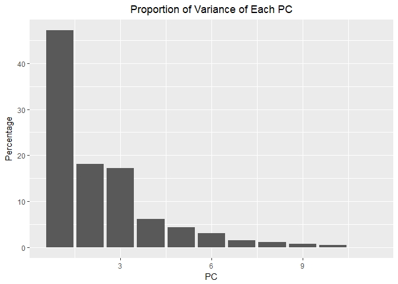
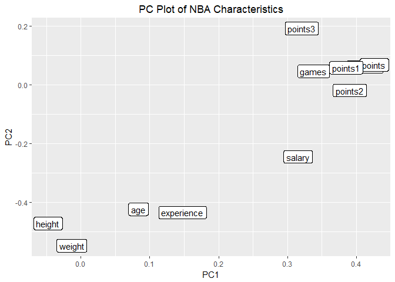
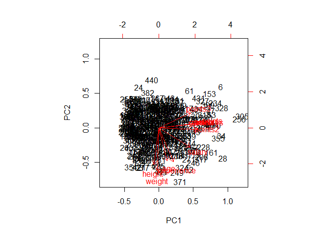

NBA Principal Component Analysis
================
Hubert Luo
February 22, 2018

``` r
library(ggplot2)
```

Run PCA and List Results
------------------------

``` r
dat <- read.csv('nba2017-players.csv', stringsAsFactors = FALSE)
quant_dat = dat[,-c(1:3,8)] #Only keep quantiative data for pca (numeric/integer data type)
pca_nba <- prcomp(quant_dat, scale. = TRUE)

eigenvalues <- pca_nba$sdev^2  #Variance of the Principal Component (PC's) is equal to the eigenvalue of the PC
eigenvaluesdf <- data.frame(1:11, eigenvalues) #Create dataframe of eigenvalues with column for each PC
names(eigenvaluesdf)[1] <- "PC"
barplot(eigenvaluesdf$eigenvalues, names.arg = eigenvaluesdf$PC, xlab = "Principal Component", ylab = "Eigenvalue", main = "Eigenvalue of Each PC", col = c("blue","gold"))
```


``` r
loadings <- pca_nba$rotation #Weights of each PC
round(loadings,3)
```

    ##               PC1    PC2    PC3    PC4    PC5    PC6    PC7    PC8    PC9
    ## height     -0.048 -0.471 -0.475 -0.121 -0.234  0.003 -0.691 -0.053  0.001
    ## weight     -0.013 -0.547 -0.397 -0.070 -0.137 -0.155  0.702  0.033 -0.004
    ## age         0.084 -0.423  0.534 -0.121  0.047 -0.190 -0.065 -0.201 -0.656
    ## experience  0.148 -0.434  0.490 -0.044  0.068 -0.124 -0.083  0.218  0.688
    ## salary      0.315 -0.245  0.055  0.487 -0.070  0.762  0.056 -0.080 -0.054
    ## games       0.338  0.046 -0.072 -0.685  0.221  0.280  0.072 -0.379  0.126
    ## minutes     0.412  0.061 -0.068 -0.281  0.072  0.111 -0.022  0.253 -0.099
    ## points      0.426  0.068 -0.089  0.120 -0.041 -0.226 -0.034  0.163 -0.067
    ## points3     0.321  0.192  0.143 -0.126 -0.836 -0.080  0.046  0.113 -0.017
    ## points2     0.390 -0.019 -0.195  0.140  0.397 -0.186 -0.074  0.464 -0.173
    ## points1     0.385  0.059 -0.108  0.360  0.055 -0.400 -0.026 -0.663  0.181
    ##              PC10   PC11
    ## height     -0.004  0.000
    ## weight      0.032  0.000
    ## age        -0.005  0.000
    ## experience  0.008  0.000
    ## salary     -0.047  0.000
    ## games      -0.343  0.000
    ## minutes     0.807  0.000
    ## points     -0.214 -0.813
    ## points3    -0.161  0.279
    ## points2    -0.344  0.478
    ## points1     0.194  0.182

Proportion of Variance
----------------------

``` r
#Add columns to evaluate variance of PC's in terms of percentages and cumulative percentages
eigenvaluesdf[,"Percentage"] <- round(eigenvaluesdf$eigenvalues/sum(eigenvaluesdf$eigenvalues)*100,2)
eigenvaluesdf[,"Cumulative_%"] <- cumsum(eigenvaluesdf$Percentage)
eigenvaluesdf
```

    ##    PC  eigenvalues Percentage Cumulative_%
    ## 1   1 5.188739e+00      47.17        47.17
    ## 2   2 1.998453e+00      18.17        65.34
    ## 3   3 1.900866e+00      17.28        82.62
    ## 4   4 6.790687e-01       6.17        88.79
    ## 5   5 4.836144e-01       4.40        93.19
    ## 6   6 3.334323e-01       3.03        96.22
    ## 7   7 1.639584e-01       1.49        97.71
    ## 8   8 1.214295e-01       1.10        98.81
    ## 9   9 8.048826e-02       0.73        99.54
    ## 10 10 4.994972e-02       0.45        99.99
    ## 11 11 3.569753e-31       0.00        99.99

``` r
barplot(eigenvaluesdf$Percentage,names.arg = eigenvaluesdf$PC, main = "Bar Chart of Eigenvalues", xlab = "Principal Component", ylab = "Eigenvalue")
```



Note that almost all of the variability (83%) is captured by the first three principal components. Almost half of the variability (47%) is captured in the first principal component.

Visualizations
--------------

``` r
loadingsdf=as.data.frame(loadings)
ggplot(data = loadingsdf,aes(x=PC1, y= PC2)) +
  geom_label(label = row.names(loadingsdf)) +
  ggtitle("PC Plot of NBA Characteristics") +
  theme(plot.title = element_text(hjust = 0.5))
```



Variables such as points, games, and salary have high PC1's between 0.3 and 0.4, indicating a strong association with these variables. On the other hand, these variables have a PC2 around 0, indicating less of an associaon between PC2 and these variables. On the other hand, PC2 is rather strongly negatively associated with variables such as height, weight, age, and experience, with values at or below -0.4. This indicates that our variables can be thought of as being in two seperate groups of correlated variables.

``` r
biplot(pca_nba, scale = 0.5)
```

 This is an example of a biplot, with the arrows scaled to represent their loadings.
